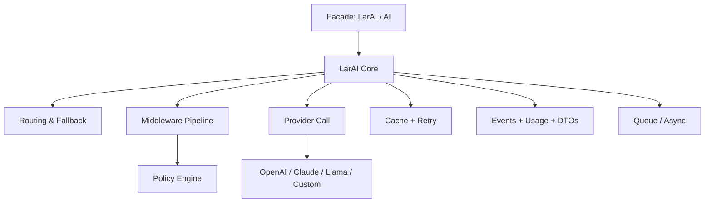

# LarAI


LarAI is a Laravel-first AI toolkit built by Aqwel AI. It offers a clean facade, modular providers, and a consistent API for text, chat, images, summarization, and embeddings.

## Table of Contents

- [Features](#features)
- [Requirements](#requirements)
- [Installation](#installation)
- [Registration in Laravel](#registration-in-laravel)
- [Configuration](#configuration)
- [Quick Start](#quick-start)
- [Documentation](#documentation)
- [Structure and Architecture](#structure-and-architecture)
- [Package Layout](#package-layout)
- [API Reference](#api-reference)
- [Response Format](#response-format)
- [Typed DTO Responses](#typed-dto-responses)
- [Middleware Pipeline](#middleware-pipeline)
- [Observability](#observability)
- [Rate-Limit Aware Queue](#rate-limit-aware-queue)
- [Prompt Registry](#prompt-registry)
- [Policy Engine](#policy-engine)
- [Structured Outputs](#structured-outputs)
- [Test Kit](#test-kit)
- [CLI](#cli)
- [Install and Setup Commands](#install-and-setup-commands)
- [Dashboard](#dashboard)
- [Common Options](#common-options)
- [Example Services](#example-services)
- [Queue and Async](#queue-and-async)
- [Logging](#logging)
- [Usage Events](#usage-events)
- [Moderation Hooks](#moderation-hooks)
- [Caching](#caching)
- [Providers](#providers)
- [Custom Providers](#custom-providers)
- [Troubleshooting](#troubleshooting)
- [License](#license)
- [Developer](#developer)

## Features

- Text generation and chat completions
- Streaming chat/text responses
- Tool/function calling (OpenAI-compatible providers)
- Image generation from prompts
- Summarization and prompt templates
- Embeddings for semantic search
- Queue/async support for heavy tasks
- Queue result tracking (request status/result lookup)
- API usage logging
- Automatic retry with backoff
- Response caching for repeated calls
- RAG helpers (chunking + vector store adapters)
- Moderation hooks via events
- File input helpers for summarize/embeddings
- Vision inputs (image + prompt)
- Audio transcription and speech
- Provider fallback routing
- Typed DTO responses (optional)
- Request/response middleware pipeline
- Observability timing events
- Rate-limit aware queue budgets
- Prompt registry (DB + versioning)
- Config-driven custom provider drivers
- Policy engine (PII redaction + guardrails)
- Structured outputs with JSON schema validation
- Test kit (mock providers)
- CLI tools (artisan)
- Dashboard module (usage/cost/errors)
- Provider-agnostic design

## Requirements

- PHP 8.1+
- Laravel 11+

## Installation

```bash
composer require aqwelai/larai
```

For quick copy-paste steps (including from source), see [INSTALL.md](INSTALL.md).

Publish the config:

```bash
php artisan vendor:publish --tag=larai-config
```

Run migrations (for prompt registry and usage dashboard tables):

```bash
php artisan migrate
```

Run package setup check:

```bash
php artisan larai:about
```

Set your API keys in `.env`:

```
LARAI_PROVIDER=openai
OPENAI_API_KEY=your-key
ANTHROPIC_API_KEY=your-key
LLAMA_API_KEY=your-key
```

## Registration in Laravel

LarAI uses Laravel package auto-discovery by default.

- Provider: `AqwelAI\LarAI\LarAIServiceProvider`
- Aliases: `LarAI`, `AI`

If auto-discovery is disabled, register in your app `config/app.php`:

```php
'providers' => [
    AqwelAI\LarAI\LarAIServiceProvider::class,
],

'aliases' => [
    'LarAI' => AqwelAI\LarAI\Facades\LarAI::class,
    'AI' => AqwelAI\LarAI\Facades\AI::class,
],
```

Common config options (`config/larai.php`):

- `larai.default` default provider
- `larai.timeout` request timeout in seconds
- `larai.logging.enabled` enable usage logging
- `larai.queue.enabled` enable queue support
- `larai.retry.*` retry/backoff configuration
- `larai.cache.*` response caching configuration
- `larai.usage.*` usage event configuration
- `larai.hooks.enabled` enable before/after request hooks
- `larai.fallback.*` provider fallback configuration
- `larai.dto.enabled` enable typed DTOs
- `larai.middlewares` request/response middleware list
- `larai.observability.enabled` timing events
- `larai.queue.rate_limits.*` queue budgets
- `larai.routing.*` routing rules
- `larai.dashboard.*` dashboard configuration
- `larai.providers.*` per-provider API keys and defaults

## Quick Start

```php
use AqwelAI\LarAI\Facades\LarAI;

$text = LarAI::text('Write a short product description.');

$chat = LarAI::chat([
    ['role' => 'system', 'content' => LarAI::prompt('chat_system')],
    ['role' => 'user', 'content' => 'What can you do?'],
]);

$summary = LarAI::summarize($longText);

$embeddings = LarAI::embeddings('A short sentence');

$image = LarAI::image('A cozy cabin in the snow');
```

## Documentation

Full documentation is available in the `docs/` folder:

- `docs/README.md` (index)
- `docs/overview.md`
- `docs/installation.md`
- `docs/configuration.md`
- `docs/core-usage.md`
- `docs/streaming.md`
- `docs/tool-calling.md`
- `docs/vision.md`
- `docs/audio.md`
- `docs/retry-and-caching.md`
- `docs/queue.md`
- `docs/routing.md`
- `docs/middleware-and-policies.md`
- `docs/dto-and-schema.md`
- `docs/rag.md`
- `docs/providers.md`
- `docs/custom-providers.md`
- `docs/prompt-registry.md`
- `docs/observability.md`
- `docs/testing.md`
- `docs/cli.md`
- `docs/dashboard.md`
- `docs/events.md`
- `docs/troubleshooting.md`

## Structure and Architecture

High‑level structure:

```
LarAI (Facade)
  -> LarAI core service
     -> Provider routing/fallback
     -> Middleware pipeline
     -> Policy engine
     -> Provider call (OpenAI/Claude/Llama/custom)
     -> Caching + retries
     -> Events + usage + DTOs
```

Architecture diagram:



## Package Layout

```
docs/                  Documentation by topic
src/
  Contracts/           Provider and capability contracts
  DTOs/                Typed response objects (optional)
  Events/              Usage, timing, and hooks
  Middleware/          Request/response pipeline
  Policies/            Guardrails and redaction
  Providers/           OpenAI, Claude, Llama implementations
  Routing/             Fallback and cost/latency routing
  Schema/              JSON schema validation helpers
  Services/            Core services (RAG, prompt registry)
  Testing/             Mock providers and fixtures
database/migrations/   Prompt registry and usage logs
```

### Facade Alias

LarAI ships with a short alias facade:

```php
use AqwelAI\LarAI\Facades\AI;

$text = AI::text('Write a short product description.');
$image = AI::image('A cozy cabin in the snow');
$recommendations = AI::recommend('cozy winter scene', [
    'snowy cabin',
    'tropical beach',
    'city skyline at night',
]);
```

## API Reference

### Text

```php
LarAI::text('Write a tagline for a coffee shop.');
```

### Chat

```php
LarAI::chat([
    ['role' => 'system', 'content' => 'You are a helpful assistant.'],
    ['role' => 'user', 'content' => 'Summarize this article.'],
]);
```

### Tool Calling

```php
$tools = [
    [
        'type' => 'function',
        'function' => [
            'name' => 'get_weather',
            'description' => 'Get the weather for a city',
            'parameters' => [
                'type' => 'object',
                'properties' => [
                    'city' => ['type' => 'string'],
                ],
                'required' => ['city'],
            ],
        ],
    ],
];

$response = LarAI::chat([
    ['role' => 'user', 'content' => 'What is the weather in Paris?'],
], [
    'tools' => $tools,
    'tool_choice' => 'auto',
]);

$toolCalls = $response['tool_calls'] ?? [];
```

### Streaming Chat

```php
foreach (LarAI::streamChat([
    ['role' => 'system', 'content' => 'You are a helpful assistant.'],
    ['role' => 'user', 'content' => 'Write a short story.'],
]) as $chunk) {
    echo $chunk;
}
```

You can also pass a callback:

```php
LarAI::streamText('Write a haiku.', [], function (string $chunk) {
    echo $chunk;
});
```

### Image

```php
LarAI::image('A minimalist poster of a city skyline', [
    'size' => '1024x1024',
]);
```

### Summarize

```php
LarAI::summarize($longText);
```

### Vision

```php
LarAI::vision('Describe this image', 'https://example.com/photo.jpg');
```

### Transcribe Audio

```php
LarAI::transcribe(storage_path('audio/meeting.wav'));
```

### Speak (Text-to-Speech)

```php
$audio = LarAI::speak('Hello from LarAI');
```

### File Summarization

```php
LarAI::summarizeFile(storage_path('docs/report.txt'));
```

### Embeddings

```php
LarAI::embeddings(['First sentence', 'Second sentence']);
```

### Recommend

```php
LarAI::recommend('cozy winter scene', [
    'snowy cabin',
    'tropical beach',
    'city skyline at night',
]);
```

### Prompt Templates

```php
$prompt = LarAI::prompt('summarize', ['text' => $text]);
```

## Response Format

All provider calls return a standardized array:

- `content` for text/chat results
- `text` for audio transcriptions
- `audio` for speech generation (base64 encoded)
- `tool_calls` for function/tool call outputs
- `images` for image generations
- `embeddings` for vector embeddings
- `recommendations` for similarity-ranked items
- `usage` when the provider reports token usage
- `raw` full provider payload

## Typed DTO Responses

Enable DTOs:

```
LARAI_DTO=true
```

When enabled, LarAI returns typed response objects (e.g. `TextResponse`, `ImageResponse`).

## Middleware Pipeline

Configure middleware in `config/larai.php` under `larai.middlewares`.

## Observability

LarAI emits `LarAIRequestTimed` with duration in ms when enabled.

## Rate-Limit Aware Queue

Configure queue budgets:

```
LARAI_QUEUE_RATE_LIMITS=true
LARAI_QUEUE_OPENAI_PER_MINUTE=60
```

## Prompt Registry

Use the registry service to create and render prompts:

```php
use AqwelAI\LarAI\Services\PromptRegistry;

$registry = app(PromptRegistry::class);
$registry->create('welcome', 'Hello {name}');
$prompt = $registry->render('welcome', ['name' => 'Aksel']);
```

Run migrations to enable the prompt registry tables.

## Policy Engine

Policies run before requests. Configure `larai.policies` and `larai.policies_denylist`.

## Structured Outputs

Validate JSON outputs with a schema:

```php
LarAI::text('Return JSON', [
    'response_schema' => [
        'type' => 'object',
        'required' => ['title'],
        'properties' => [
            'title' => ['type' => 'string'],
        ],
    ],
]);
```

## Test Kit

```php
use AqwelAI\LarAI\Testing\MockProvider;

LarAI::registerProvider('mock', new MockProvider());
```

```php
use AqwelAI\LarAI\Testing\LarAIAssertions;
```

## CLI

```bash
php artisan larai:about
php artisan larai:run "Hello"
php artisan larai:install
php artisan larai:prompt:list
php artisan larai:prompt:create welcome "Hello {name}" --tags=onboarding,marketing
php artisan larai:prompt:activate welcome 2
```

## Install and Setup Commands

```bash
# Show package info and setup hints
php artisan larai:about

# Publish config + scaffold listener
php artisan larai:install

# Prompt registry management
php artisan larai:prompt:list
php artisan larai:prompt:create welcome "Hello {name}" --tags=onboarding
php artisan larai:prompt:activate welcome 2
```

## Dashboard

Enable:

```
LARAI_DASHBOARD=true
LARAI_DASHBOARD_STORE_USAGE=true
```

Run migrations to enable the dashboard tables.
## Common Options

You can pass options to any call:

- `provider` override default provider
- `fallback` enable/disable fallback routing
- `model` select a model
- `temperature` control creativity (chat/text)
- `max_tokens` cap output length
- `async` queue in the background when enabled
- `cache` enable response caching
- `cache_ttl` override cache TTL in seconds

Example:

```php
LarAI::text('Hello', [
    'provider' => 'claude',
    'model' => 'claude-3-5-sonnet-20240620',
    'max_tokens' => 200,
]);
```

Provider fallback example:

```php
LarAI::text('Hello', [
    'provider' => ['openai', 'llama'],
]);
```

## Example Services

```php
use AqwelAI\LarAI\Services\TextService;
use AqwelAI\LarAI\Services\ImageService;
use AqwelAI\LarAI\Services\EmbeddingsService;
use AqwelAI\LarAI\Services\RagService;
use AqwelAI\LarAI\VectorStores\InMemoryVectorStore;

$textService = app(TextService::class);
$result = $textService->generate('Write a tagline for a coffee shop.');

$imageService = app(ImageService::class);
$image = $imageService->generate('A minimalist poster of a city skyline.');

$embeddingsService = app(EmbeddingsService::class);
$vectors = $embeddingsService->generate(['First sentence', 'Second sentence']);

$ragService = app(RagService::class);
$store = new InMemoryVectorStore();
$ragService->index($longText, $store);
$matches = $ragService->search('Explain the key points', $store);
```

## Queue and Async

Enable queue support in `.env`:

```
LARAI_QUEUE=true
LARAI_QUEUE_TRACK_RESULTS=true
```

Queue a job directly:

```php
LarAI::queueText('Generate a long report', [
    'provider' => 'openai',
]);
```

If queue result tracking is enabled, queue methods return a `request_id`:

```php
$queued = LarAI::queueText('Generate a long report');
$status = LarAI::queueStatus($queued['request_id']);
$result = LarAI::queueResult($queued['request_id']);
```

Or request async within the call:

```php
LarAI::text('Draft a press release', [
    'async' => true,
]);
```

## Logging

Enable usage logging:

```
LARAI_LOGGING=true
LARAI_LOG_CHANNEL=stack
```

When the provider returns usage data, LarAI logs provider and token usage.

## Usage Events

LarAI emits a `LarAIUsageReported` event when providers return usage data. You can listen
to it to track costs or persist usage in your app.

```php
use AqwelAI\LarAI\Events\LarAIUsageReported;

Event::listen(LarAIUsageReported::class, function (LarAIUsageReported $event) {
    // Store $event->usage with $event->provider and $event->method
});
```

## Moderation Hooks

Use the before/after request events to block or inspect requests.

```php
use AqwelAI\LarAI\Events\LarAIBeforeRequest;

Event::listen(LarAIBeforeRequest::class, function (LarAIBeforeRequest $event) {
    if ($event->method === 'chat') {
        // Return false to block the request
        return false;
    }
});
```

## Caching

Enable caching in `.env`:

```
LARAI_CACHE=true
LARAI_CACHE_TTL=300
```

You can also enable cache per call:

```php
LarAI::text('Draft a product description.', [
    'cache' => true,
    'cache_ttl' => 600,
]);
```

## Providers

Built-in providers:

- OpenAI (`openai`)
- Claude (Anthropic) (`claude`)
- LLaMA via OpenAI-compatible APIs (`llama`)

Each provider reads configuration from `config/larai.php`.

### Service Contracts (for Laravel developers)

You can type-hint LarAI service contracts in your app code:

```php
use AqwelAI\LarAI\Contracts\TextServiceContract;
use AqwelAI\LarAI\Contracts\ImageServiceContract;
use AqwelAI\LarAI\Contracts\EmbeddingsServiceContract;
use AqwelAI\LarAI\Contracts\PromptRegistryContract;
```

These are aliased in the service provider and resolved from the container.

## Custom Providers

Implement the `Provider` contract and register it at runtime:

```php
use AqwelAI\LarAI\Contracts\Provider;
use AqwelAI\LarAI\Facades\LarAI;

class MyProvider implements Provider
{
    public function name(): string { return 'custom'; }
    public function text(string $prompt, array $options = []): array { /* ... */ }
    public function chat(array $messages, array $options = []): array { /* ... */ }
    public function image(string $prompt, array $options = []): array { /* ... */ }
    public function summarize(string $text, array $options = []): array { /* ... */ }
    public function embeddings(string|array $input, array $options = []): array { /* ... */ }
}

LarAI::registerProvider('custom', new MyProvider());
```

You can also register providers by config driver:

```php
'providers' => [
    'custom' => [
        'driver' => App\AI\MyProvider::class,
    ],
]
```

## Troubleshooting

- Ensure API keys are present in `.env`
- Verify `LARAI_PROVIDER` matches a configured provider
- If queueing, run a Laravel queue worker

## License

Apache 2.0

## Developer

Aksel Aghajanyan ([GitHub](https://github.com/Aksel588))
