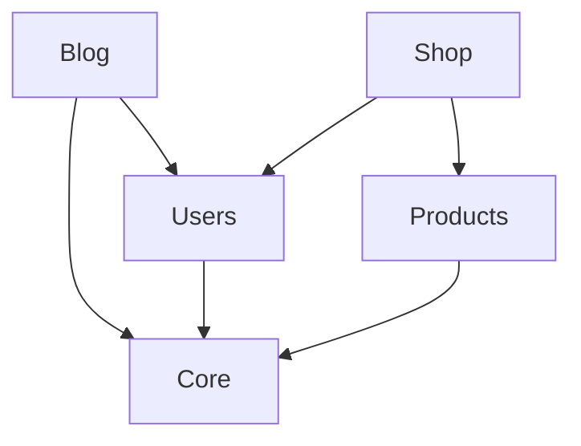

# Modular Architecture for Laravel

Build scalable Laravel applications with self-contained modules.

[](https://php.net/)
[](https://laravel.com)
[](LICENSE)
[](https://e-segments.github.io/modular-architecture/)

---

## Why Modular?

As your Laravel app grows, a single `app/` folder becomes unwieldy. This package lets you organize your code into **independent modules** - each with its own models, controllers, migrations, and tests.

**What you get:**

- **Clean separation** - Each feature in its own folder
- **Dependency management** - Modules declare what they need
- **Easy sharing** - Install modules from GitHub
- **Production ready** - Octane support, caching, validation
- **Developer friendly** - Beautiful CLI with Laravel Prompts

---

## Installation

```bash
composer require esegments/modular-architecture
```

Publish the config:

```bash
php artisan vendor:publish --tag=modular-config
```

That's it! Start creating modules.

---

## Quick Start

### Create Your First Module

```bash
php artisan modular:make Blog --all
```

This creates a complete module structure:

```
Modules/
└── Blog/
    ├── app/
    │   ├── Http/Controllers/
    │   ├── Models/
    │   └── Providers/BlogServiceProvider.php
    ├── database/
    │   ├── factories/
    │   ├── migrations/
    │   └── seeders/
    ├── resources/views/
    ├── routes/
    │   ├── api.php
    │   └── web.php
    ├── tests/
    ├── composer.json
    └── module.json       ← Module manifest
```

### The module.json File

Every module has a manifest that defines its metadata and dependencies:

```json
{
    "name": "Blog",
    "alias": "blog",
    "version": "1.0.0",
    "description": "A blog module with posts and comments",
    "providers": [
        "Modules\\Blog\\Providers\\BlogServiceProvider"
    ],
    "requires": {
        "Core": "^1.0",
        "Users": "^2.0"
    }
}
```

### Enable & Disable Modules

```bash
# Enable a module
php artisan modular:enable Blog

# Disable a module (if nothing depends on it)
php artisan modular:disable Blog

# See what depends on a module
php artisan modular:dependents Core
```

---

## Working with Modules

### List All Modules

```bash
php artisan modular:list
```

```
┌──────────┬─────────┬─────────┬──────────────────────┐
│ Module   │ Version │ Status  │ Dependencies         │
├──────────┼─────────┼─────────┼──────────────────────┤
│ Core     │ 1.0.0   │ Enabled │ -                    │
│ Users    │ 2.1.0   │ Enabled │ Core ^1.0            │
│ Blog     │ 1.0.0   │ Enabled │ Core ^1.0, Users ^2.0│
│ Analytics│ 0.5.0   │ Disabled│ Core ^1.0            │
└──────────┴─────────┴─────────┴──────────────────────┘
```

### Check Module Status

```bash
php artisan modular:status
```

Shows detailed statistics about your modules.

### Validate Dependencies

```bash
# Check all modules
php artisan modular:validate

# Check specific module
php artisan modular:validate Blog

# Strict mode (fail on warnings too)
php artisan modular:validate --strict
```

---

## Generate Classes in Modules

All Laravel `make:*` commands work with modules! Just add `--module`:

```bash
# Create a model in the Blog module
php artisan make:model Post --module=Blog

# Create a controller
php artisan make:controller PostController --module=Blog

# Create a migration
php artisan make:migration create_posts_table --module=Blog

# Create everything at once
php artisan make:model Post --module=Blog --controller --factory --migration --seeder
```

### Supported Commands

| Command | Module Location |
|---------|-----------------|
| `make:model` | `Modules/{Name}/app/Models/` |
| `make:controller` | `Modules/{Name}/app/Http/Controllers/` |
| `make:migration` | `Modules/{Name}/database/migrations/` |
| `make:factory` | `Modules/{Name}/database/factories/` |
| `make:seeder` | `Modules/{Name}/database/seeders/` |
| `make:policy` | `Modules/{Name}/app/Policies/` |
| `make:event` | `Modules/{Name}/app/Events/` |
| `make:listener` | `Modules/{Name}/app/Listeners/` |
| `make:job` | `Modules/{Name}/app/Jobs/` |
| `make:notification` | `Modules/{Name}/app/Notifications/` |
| `make:mail` | `Modules/{Name}/app/Mail/` |
| `make:rule` | `Modules/{Name}/app/Rules/` |
| `make:request` | `Modules/{Name}/app/Http/Requests/` |
| `make:resource` | `Modules/{Name}/app/Http/Resources/` |
| `make:test` | `Modules/{Name}/tests/` |

---

## Install Modules from GitHub

Share modules across projects by hosting them on GitHub!

### Install a Module

```bash
# From owner/repo
php artisan modular:install esegments/blog-module

# From full URL
php artisan modular:install https://github.com/esegments/blog-module

# Specific version
php artisan modular:install esegments/blog-module --version=v2.0.0
```

### Check for Updates

```bash
php artisan modular:outdated
```

```
┌────────┬─────────┬───────────┬────────────────────────┐
│ Module │ Current │ Latest    │ Repository             │
├────────┼─────────┼───────────┼────────────────────────┤
│ Blog   │ 1.0.0   │ 1.2.0     │ esegments/blog-module  │
│ Users  │ 2.0.0   │ 2.0.0     │ (up to date)           │
└────────┴─────────┴───────────┴────────────────────────┘
```

### Update Modules

```bash
# Update one module
php artisan modular:update Blog

# Update to specific version
php artisan modular:update Blog --version=v1.1.0

# Update all modules
php artisan modular:update --all

# Preview what would be updated
php artisan modular:update --all --dry-run
```

### Private Repositories

For private repos, add your GitHub token:

```env
MODULAR_GITHUB_TOKEN=ghp_xxxxxxxxxxxxx
```

---

## Using the Facade

```php
use Esegments\ModularArchitecture\Facades\Modular;

// Get all modules
$modules = Modular::all();

// Get only enabled modules (in load order)
$enabled = Modular::enabled();

// Find a specific module
$blog = Modular::find('Blog');

// Check if a module exists or is enabled
if (Modular::exists('Blog') && Modular::isEnabled('Blog')) {
    // ...
}

// Enable/disable modules
Modular::enable('Blog');
Modular::disable('Blog');

// Get modules that depend on another
$dependents = Modular::getDependents('Core');
// Returns: ['Users', 'Blog', 'Shop']

// Validate a module
$result = Modular::validate('Blog');
if (! $result->isValid()) {
    foreach ($result->errors as $error) {
        logger()->error($error);
    }
}
```

---

## Visualize Dependencies

See how your modules connect:

```bash
# Pretty text output
php artisan modular:graph

# DOT format (for Graphviz)
php artisan modular:graph --format=dot > deps.dot
dot -Tpng deps.dot -o deps.png

# Mermaid format (for GitHub/GitLab)
php artisan modular:graph --format=mermaid
```

**Mermaid output example:**



---

## Version Constraints

Modules use semantic versioning with `composer/semver`:

| Constraint | Matches |
|------------|---------|
| `^1.0` | >=1.0.0 and <2.0.0 |
| `~1.5` | >=1.5.0 and <2.0.0 |
| `>=2.0 <3.0` | 2.x versions only |
| `1.0.*` | Any 1.0.x version |
| `*` | Any version |

**Example module.json:**

```json
{
    "requires": {
        "Core": "^1.0",
        "Users": ">=2.0 <3.0"
    }
}
```

---

## Storage Options

Module states (enabled/disabled) can be stored in files or database.

### Filesystem (Default)

```env
MODULAR_STORAGE_DRIVER=file
MODULAR_STORAGE_PATH=storage/modular
```

### Database

```bash
# Publish and run migration
php artisan vendor:publish --tag=modular-migrations
php artisan migrate
```

```env
MODULAR_STORAGE_DRIVER=database
MODULAR_STORAGE_TABLE=modules
```

### Migrate Between Drivers

```bash
# Move from files to database
php artisan modular:storage:migrate --from=file --to=database
```

---

## Production Optimization

For production, cache the module discovery:

```bash
# Validate and build cache
php artisan modular:optimize

# Or step by step
php artisan modular:validate --strict
php artisan modular:cache
```

Clear the cache:

```bash
php artisan modular:cache:clear
```

---

## Laravel Octane Support

This package is **fully compatible with Laravel Octane**. Module information is cached in memory for maximum performance.

The cache is automatically warmed when Octane workers start. If you enable/disable modules at runtime:

```php
use Esegments\ModularArchitecture\Facades\Modular;

// After enabling/disabling modules, refresh the cache
Modular::refresh();
```

---

## Framework Bridges

Bridges automatically discover and register framework-specific components from your modules. Enable only the bridges you need.

### Enable Bridges

```env
# Core framework bridges
MODULAR_BRIDGE_ROUTES=true
MODULAR_BRIDGE_BLADE=true
MODULAR_BRIDGE_MIGRATIONS=true
MODULAR_BRIDGE_TRANSLATIONS=true
MODULAR_BRIDGE_EVENTS=true
MODULAR_BRIDGE_COMMANDS=true

# Model/Auth bridges
MODULAR_BRIDGE_OBSERVERS=true
MODULAR_BRIDGE_POLICIES=true
MODULAR_BRIDGE_MIDDLEWARE=true
MODULAR_BRIDGE_SERVICES=true

# External framework bridges
MODULAR_BRIDGE_LIVEWIRE=true
MODULAR_BRIDGE_FILAMENT=true
MODULAR_BRIDGE_SCHEDULE=true

# Bridge caching for production
MODULAR_BRIDGE_CACHE=true
```

### Available Bridges

| Bridge | Discovery Path | Auto-Registers |
|--------|----------------|----------------|
| **Routes** | `routes/*.php` | Web/API routes with module prefix |
| **Blade** | `resources/views/` | View namespace `module-name::view` |
| **Migrations** | `database/migrations/` | Migrations with Laravel migrator |
| **Translations** | `lang/*.php`, `lang/*.json` | Trans namespace `module-name::key` |
| **Events** | `app/Listeners/`, `app/Subscribers/` | Event listeners & subscribers |
| **Commands** | `app/Console/Commands/` | Artisan commands |
| **Observers** | `app/Observers/` | Model observers (by convention) |
| **Policies** | `app/Policies/` | Authorization policies |
| **Middleware** | `app/Http/Middleware/` | Aliased as `module.name` |
| **Services** | `app/Contracts/`, `app/Services/` | Contract -> Implementation bindings |
| **Livewire** | `app/Livewire/` | Components as `<livewire:module::name />` |
| **Filament** | `app/Filament/` | Resources, Pages, Widgets, Clusters |
| **Schedule** | `app/Console/Schedule.php` | Scheduled tasks |

### Bridge Usage Examples

#### Routes Bridge
```php
// Modules/Products/routes/web.php
Route::get('/products', [ProductController::class, 'index']);

// Accessible at: /products (with 'products' prefix if enabled)
// Named: products.index
```

#### Blade Bridge
```blade
{{-- Use module views --}}
@include('products::partials.card')

{{-- Use module components --}}
<x-products::button />
```

#### Translations Bridge
```php
// Modules/Products/lang/en/messages.php
return ['created' => 'Product created'];

// Usage
trans('products::messages.created');
__('products::messages.created');
```

#### Observers Bridge
```php
// Modules/Products/app/Observers/ProductObserver.php
// Auto-registers to observe Product model (by naming convention)
```

#### Services Bridge
```php
// Modules/Products/app/Contracts/ProductServiceContract.php
interface ProductServiceContract {
    public function findById(int $id): ?Product;
}

// Modules/Products/app/Services/ProductService.php
class ProductService implements ProductServiceContract { }

// Auto-bound: resolve(ProductServiceContract::class) -> ProductService
```

#### Livewire Bridge
```php
// Modules/Products/app/Livewire/ProductTable.php
// Registered as: <livewire:products::product-table />
```

#### Filament Bridge
```php
// In your PanelProvider
public function panel(Panel $panel): Panel
{
    $bridge = app(FilamentBridge::class);

    return $panel
        ->resources($bridge->getResources())
        ->pages($bridge->getPages())
        ->widgets($bridge->getWidgets());
}
```

### Bridge CLI Commands

```bash
# List all bridges and their status
php artisan modular:bridges

# Inspect a specific bridge
php artisan modular:bridges:inspect blade

# Cache bridges for production
php artisan modular:bridges:cache

# Clear bridge cache
php artisan modular:bridges:clear
```

### Bridge Output Example

```
┌─────────────┬───────────┬──────────┬─────────┐
│ Bridge      │ Available │ Status   │ Modules │
├─────────────┼───────────┼──────────┼─────────┤
│ blade       │ ✓         │ Enabled  │ 5       │
│ routes      │ ✓         │ Enabled  │ 3       │
│ livewire    │ ✓         │ Enabled  │ 2       │
│ filament    │ ✓         │ Disabled │ -       │
│ migrations  │ ✓         │ Enabled  │ 4       │
└─────────────┴───────────┴──────────┴─────────┘
```

---

## Extension Points (Optional)

Install `esegments/laravel-extensions` to hook into module lifecycle events:

```bash
composer require esegments/laravel-extensions
```

Then register handlers:

```php
use Esegments\LaravelExtensions\Facades\Extensions;
use Esegments\ModularArchitecture\Extensions\Points\BeforeModuleEnable;
use Esegments\ModularArchitecture\Extensions\Points\ModuleEnabled;

// Veto enabling a module
Extensions::register(BeforeModuleEnable::class, function ($point) {
    if ($point->moduleName === 'DebugModule' && app()->isProduction()) {
        $point->addError('Cannot enable debug module in production');
        return false;
    }
});

// React after a module is enabled
Extensions::register(ModuleEnabled::class, function ($point) {
    Artisan::call('migrate', ['--path' => $point->module->getMigrationPath()]);
    cache()->tags('modules')->flush();
});
```

**Available extension points:**

| Extension Point | When | Can Veto? |
|-----------------|------|-----------|
| `BeforeModuleEnable` | Before enabling | Yes |
| `ModuleEnabled` | After enabled | No |
| `BeforeModuleDisable` | Before disabling | Yes |
| `ModuleDisabled` | After disabled | No |

---

## All Commands

| Command | Description |
|---------|-------------|
| `modular:make` | Create a new module |
| `modular:list` | List all modules |
| `modular:status` | Show statistics |
| `modular:enable {name}` | Enable a module |
| `modular:disable {name}` | Disable a module |
| `modular:validate` | Validate dependencies |
| `modular:dependents {name}` | Show dependents |
| `modular:graph` | Visualize dependencies |
| `modular:remove {name}` | Remove a module |
| `modular:install {repo}` | Install from GitHub |
| `modular:update {name}` | Update modules |
| `modular:outdated` | Check for updates |
| `modular:cache` | Build discovery cache |
| `modular:cache:clear` | Clear caches |
| `modular:optimize` | Optimize for production |
| `modular:storage:migrate` | Change storage driver |

---

## Configuration Reference

```php
// config/modular.php

return [
    // Where to look for modules
    'paths' => [
        base_path('Modules'),
        base_path('packages'),
    ],

    // Modules that cannot be disabled
    'protected' => [
        'Core',
    ],

    // Storage settings
    'storage' => [
        'driver' => env('MODULAR_STORAGE_DRIVER', 'file'),
        'path' => storage_path('modular'),
        'table' => 'modules',
        'connection' => env('MODULAR_STORAGE_CONNECTION'),
    ],

    // Cache settings
    'cache' => [
        'enabled' => env('MODULAR_CACHE', true),
        'ttl' => 86400, // 24 hours
    ],

    // GitHub integration
    'github' => [
        'token' => env('MODULAR_GITHUB_TOKEN'),
        'timeout' => 30,
    ],

    // Strict mode fails on missing dependencies
    'strict' => env('MODULAR_STRICT', false),

    // Override Laravel make:* commands
    'commands' => [
        'override' => env('MODULAR_COMMANDS_OVERRIDE', true),
    ],
];
```

---

## Testing

```bash
composer test
```

---

## License

MIT License. See [LICENSE](LICENSE) for details.

---

## Documentation

📖 **Full documentation available at: [e-segments.github.io/modular-architecture](https://e-segments.github.io/modular-architecture/)**

---

## Credits

Built with care by [Esegments](https://esegments.com).
