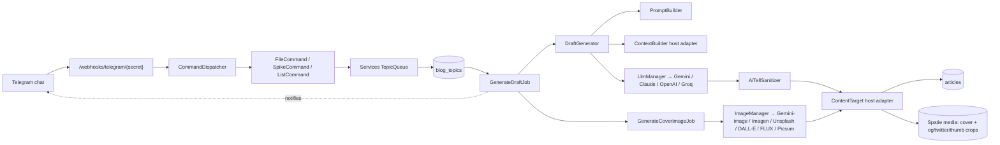

# 🧵 laravel-stringer

> A Telegram-driven LLM blog drafter for Laravel — pairs a chat-first interface with a configurable AI pipeline to produce **per-locale drafts with auto-generated cover images** for human review. Never auto-publishes implicitly. Every part of the pipeline — prompts, field schema, voice card, image style — is editable in Filament without a deploy.

[](LICENSE)
[](https://www.php.net)
[](https://laravel.com)
[](https://pestphp.com)
[](https://phpstan.org)


---

## ⚡ Quickstart (5 minutes)

Get from zero to your first draft in five steps:

```bash
# 1. Install
composer require giorgigrdzelidze/laravel-stringer
php artisan migrate
php artisan db:seed --class="Stringer\Laravel\Database\Seeders\StringerDefaultPromptsSeeder"
php artisan db:seed --class="Stringer\Laravel\Database\Seeders\StringerDefaultContentFieldsSeeder"
```

```env
# 2. Add to .env — pick any one LLM provider
STRINGER_LLM_DRIVER=gemini
STRINGER_GEMINI_API_KEY=AIzaSy...
GEMINI_MODEL=gemini-flash-latest
STRINGER_LLM_HTTP_TIMEOUT=120
```

```php
// 3. Bind two adapters in any service provider
$this->app->bind(\Stringer\Laravel\Contracts\ContentTarget::class, ArticleTarget::class);
$this->app->bind(\Stringer\Laravel\Contracts\ContextBuilder::class, PublicContextBuilder::class);
```

```php
// 4. Register the Filament plugin
->plugin(\Stringer\Laravel\Filament\StringerPlugin::make())
```

```bash
# 5. Trigger your first draft
php artisan queue:work &
php artisan tinker --execute="\$t = app(Stringer\Laravel\Services\TopicQueue::class)->enqueue('write about laravel queue retries', Stringer\Laravel\Enums\TopicSource::Manual); Stringer\Laravel\Jobs\GenerateDraftJob::dispatch(\$t->id);"
```

Open `/admin/blog-topic-resource/blog-topics` — your topic flips from `Queued` → `Drafting` → `Drafted` and a new article appears at `/admin/articles` ready for review.

> 💬 Want the chat-first experience? Add `STRINGER_TELEGRAM_BOT_TOKEN` + `STRINGER_TELEGRAM_WEBHOOK_SECRET`, set your bot's webhook to `/webhooks/telegram/{secret}`, and message `/generate <topic>`.

---

## ✨ What it does

`stringer` is a small back office for blog content:

1. 📥 An operator (or scheduler) creates a **topic** — a hint, a tag, a stray idea.
2. 🛠️ A queued job composes an LLM prompt from a configurable **field schema** (`StringerContentField`) and a configurable **prompt template** (`StringerPrompt`), both editable in Filament.
3. 🤖 The LLM returns a JSON object keyed by field name. Translatable fields come back per-locale; non-translatable values pass through as-is.
4. 🧹 A deterministic **AI-tell sanitizer** strips giveaway phrases ("furthermore", "in conclusion", "it's worth noting") before the draft is written.
5. 📝 The package hands a `LocalizedDraft` to the host's `ContentTarget` adapter, which writes the draft as `status='draft'` for human review.
6. 🖼️ A chained `GenerateCoverImageJob` produces a cover image via the configured image driver (`gemini-image` / Imagen 3 / Unsplash / DALL-E 3 / FLUX / Picsum), attaches it to the article, and Spatie Media Library auto-derives `og` (1200×630), `twitter` (1200×675), and `thumb` (400×225) crops.
7. 🚀 When the operator trusts the pipeline for a recurring topic, flipping `auto_publish` + `target_status` on the topic publishes it directly on the next generate.

---

## 🖼️ See it in action

### Filament — Topics queue


Inspect status, click *Generate Now*, or spike rejected hints.

### Filament — Articles dashboard


Every draft lands with per-locale columns (`EN · KA · RU`), a cover thumbnail, and a category — never auto-published. The operator reviews each one before flipping the status to `published`.

### Telegram — Draft pipeline

| ✅ Draft ready | ❌ Error surfaced |
|:---:|:---:|
|  |  |
| Cover image + bold title + excerpt + stats + admin link land as a photo card with the host badge. One notification per drafted article. | Every upstream failure (LLM quota, image-API paid-plan, JSON parse error, slug collision) surfaces in chat with a humanized reason. Never have to grep logs to know what broke. |

### Telegram — Menu navigation

| 1. `/start` opens the root menu | 2. Drill into a category | 3. Settings & language |
|:---:|:---:|:---:|
|  |  |  |
| Reply-keyboard menu reached via `/start` or `/menu`. Five top-level paths: Generate, Topics, Categories, Settings, Help. | Drill-down with persistent back buttons; per-chat state means you can leave and come back without losing your place. | Per-chat language preference (`en` / `ka` / `ru`), allowed-chat-ID list, and other operator knobs — all editable from inside Telegram. |

### Filament — Operator surfaces

| SEO tab — multi-channel | Settings page |
|:---:|:---:|
|  |  |
| `meta_title`, `meta_description`, `og_title`, `og_description`, `twitter_title`, `twitter_description` — all filled by the LLM per locale, all editable. | Voice card, body word cap, tag count, cron, timezone, allowed chat IDs — all editable in admin, no deploy. |

| DB-editable prompts | Data-driven field schema |
|:---:|:---:|
|  |  |
| Three seeded templates: `draft`, `translate`, `cover_image`. Edit the prompt content directly to retune voice, style, or structure — the next generation uses the new template, no deploy. | 12 baseline fields shipped (`title`, `excerpt`, `slug`, `body`, `meta_*`, `og_*`, `twitter_*`, `tags`, `category`). Add your own, mark required, set per-locale constraints — the LLM is told to fill exactly the active schema. |

---

## 🏗️ Architecture



Every arrow is mockable in tests. Every box marked "host adapter" is something the host implements; everything else ships in the package.

---

## 🎯 Quality defaults

The seeded defaults are built around **what experienced engineers actually want to read**:

| Surface | Default |
|---------|---------|
| **Draft prompt** | 4 kB template with explicit voice rules, an anti-AI-tell phrase list, code-must-compile rule, heading conventions, and a worked few-shot example output |
| **Translate prompt** | Preserves code, function names, library names, brand names, CLI flags, file paths, and HTML/JSON keys verbatim |
| **Voice card** | Senior-engineer voice — first-person where the topic is experience, third-person where it's reference. Plainspoken, opinionated, no marketing language |
| **Title field** | Max 70 chars, sentence-case English, anti-clickbait, anti-"Ultimate / Complete / Definitive" word list |
| **Excerpt field** | Max 200 chars, ~25-35 words, active voice, stands alone as meta description |
| **Body field** | Max 1500 words, opens with a concrete scenario (never a definition), H2/H3 only, working code samples required |
| **Tags field** | Multilingual — LLM returns `{"en":[...], "ka":[...], "ru":[...]}` with parallel index ordering. Tech / brand names not translated |
| **Post-processing** | `AiTellSanitizer` strips ~30 giveaway phrases (`Furthermore,`, `Moreover,`, `In conclusion,`, `It's worth noting,`, `In today's fast-paced world,`, …) — case-insensitive, code-block-safe |
| **Cover image** | Default driver `gemini-image` (free tier on Gemini, reuses `STRINGER_GEMINI_API_KEY`). One master 1792×1024 + auto-derived og/twitter/thumb crops. Editable visual prompt + style suffix |

Every default is editable in Filament. Hosts that want a different voice, longer bodies, or different fields just change the rows — no deploy required.

---

## 📝 Sample output

Real output from the default prompt on `gemini-flash-latest`, hint *"Idempotent queue jobs in Laravel: deduplication strategies, distributed locks via Redis, handling out-of-order delivery, and observability hooks."*

<details>
<summary>Show generated draft</summary>

**Title** *(EN)*
> Building Idempotent Queue Jobs in Laravel: Strategies and Implementation

**Excerpt** *(EN)*
> Ensuring consistency in Laravel background tasks through deduplication, Redis distributed locks, and handling out-of-order execution.

**Meta title** *(EN)*
> Implementing Idempotent Queue Jobs in Laravel

**Meta description** *(EN)*
> Technical guide on building idempotent Laravel queue jobs using Redis locks, deduplication, and out-of-order execution handling.

**Body** *(EN, first paragraph)*
> In distributed systems, queue jobs may be executed more than once due to network timeouts, worker crashes, or manual retries. Idempotency ensures that performing an operation multiple times produces the same result as a single execution. This is critical when handling financial transactions, such as those integrated via the `laravel-bog-sdk` or `laravel-rsge` packages.

**Tags**
> `laravel`, `backend-development`, `queue`, `idempotency`, `redis`

Generated in ~24 seconds end-to-end (one LLM call for the EN draft + all locales). All seven seeded SEO fields were populated in the same call; per-locale translations for EN/KA/RU came back in the same response.
</details>

---

## 📦 Install

```bash
composer require giorgigrdzelidze/laravel-stringer
php artisan migrate
```

The package registers its own service provider via `extra.laravel.providers`. After migrate:

```bash
php artisan db:seed --class="Stringer\Laravel\Database\Seeders\StringerDefaultPromptsSeeder"
php artisan db:seed --class="Stringer\Laravel\Database\Seeders\StringerDefaultContentFieldsSeeder"
```

The seeders are auto-run on the first console boot if their tables are empty; the explicit `db:seed` is for forced re-seeds.

---

## ⚙️ Configuration

### Environment variables

| Variable | Default | Purpose |
|----------|---------|---------|
| `STRINGER_LLM_DRIVER` | `gemini` | LLM driver: `gemini`, `claude`, `openai`, or `groq` |
| `STRINGER_GEMINI_API_KEY` | — | API key when driver is `gemini` |
| `STRINGER_CLAUDE_API_KEY` | — | API key when driver is `claude` |
| `STRINGER_OPENAI_API_KEY` | — | API key when driver is `openai` |
| `STRINGER_GROQ_API_KEY` | — | API key when driver is `groq` |
| `GEMINI_MODEL` | `gemini-2.0-flash` | Per-driver model identifier |
| `CLAUDE_MODEL` | `claude-sonnet-4-5` | |
| `OPENAI_MODEL` | `gpt-4o-mini` | |
| `GROQ_MODEL` | `llama-3.3-70b-versatile` | |
| `STRINGER_LLM_HTTP_TIMEOUT` | `120` | HTTP timeout (seconds) for a single LLM round-trip. Bump if you see cURL error 28 on dense prompts |
| `STRINGER_TELEGRAM_ENABLED` | `true` | Skips webhook route registration when `false` |
| `STRINGER_TELEGRAM_BOT_TOKEN` | — | Bot token from BotFather |
| `STRINGER_TELEGRAM_WEBHOOK_SECRET` | — | 16+ alphanumeric chars (`[A-Za-z0-9_-]{16,}`) used as the URL secret on `/webhooks/telegram/{secret}` |
| `STRINGER_TELEGRAM_ALLOWED_CHAT_IDS` | — | Comma-separated chat IDs allowed to drive the bot. Non-allowlisted chats get `200 OK` with empty body |
| `STRINGER_AUTO_GENERATE_CRON` | `0 9 * * 1` | When the weekly auto-generate job fires |
| `STRINGER_AUTO_GENERATE_TZ` | `Asia/Tbilisi` | Timezone for the cron above |
| `STRINGER_ARTICLE_MODEL` | — | FQN of the host's article model — required only if you use `BlogTopic::article()` |
| `STRINGER_SEED_DEFAULTS_ON_BOOT` | `true` | Auto-run seeders if tables are empty. Set `false` in containers that boot many short-lived consoles |
| `STRINGER_TELEGRAM_ADMIN_BASE_URL` | — | Optional public-facing host used to rewrite admin links sent over Telegram. Useful in local dev where `editUrl()` returns `http://localhost/...` — set to an ngrok URL while testing; leave unset in production |
| **Cover images** | | |
| `STRINGER_IMAGE_ENABLED` | `true` | Master switch — turn off to skip cover generation entirely |
| `STRINGER_IMAGE_DRIVER` | `gemini-image` | `gemini-image` (default, free tier, reuses Gemini key), `imagen`, `unsplash`, `dalle`, `flux`, or `picsum` |
| `STRINGER_IMAGE_STYLE` | editorial illustration… | One-line style suffix appended to every visual prompt. Edit to change the look across all drivers |
| `STRINGER_IMAGE_MASTER_SIZE` | `1792x1024` | Master image size requested from the driver. Spatie crops down to `og`/`twitter`/`thumb` automatically |
| `STRINGER_IMAGE_REQUIRE_CONFIRMATION` | `false` | If `true`, Telegram preview + ✅/🔁/✕ keyboard before the cover is attached *(deferred — flag wired, menu node not yet shipped)* |
| `STRINGER_IMAGE_MAX_REGENERATES` | `3` | Ceiling on 🔁 regenerate taps per topic — prevents accidental runaway cost |
| `STRINGER_IMAGE_HTTP_TIMEOUT` | `60` | HTTP timeout (seconds) for one image API round-trip |
| `STRINGER_IMAGEN_MODEL` | `imagen-3.0-generate-001` | Imagen model identifier |
| `STRINGER_GEMINI_IMAGE_MODEL` | `gemini-2.5-flash-image` | Gemini image-generation model used by the `gemini-image` driver (free tier on Gemini) |
| `STRINGER_UNSPLASH_ACCESS_KEY` | — | Access key when driver is `unsplash` (free path) |
| `STRINGER_DALLE_MODEL` | `dall-e-3` | DALL-E model identifier |
| `STRINGER_FAL_KEY` | — | API key when driver is `flux` (uses fal.ai) |
| `STRINGER_FLUX_MODEL` | `fal-ai/flux/dev` | FLUX model identifier on fal.ai |

---

## 🖼️ Cover images

Every draft gets an auto-generated cover. The cover job is **chained** off the draft job — if the LLM succeeds, the image pipeline runs next. Failure is non-fatal: a missing cover never unwinds the article, it just logs and exits.

### Pipeline

```
GenerateDraftJob              ←  LLM + sanitize + write article
       │
       └── chains ───────►  GenerateCoverImageJob
                                   │
                                   ├── PromptBuilder::buildImagePrompt(title, excerpt, style)
                                   │       → DB-row override or DefaultPromptBuilder::IMAGE_TEMPLATE
                                   │
                                   ├── ImageManager::make() → resolved driver
                                   │       → ImagenClient | UnsplashClient | DallE3Client | FluxClient
                                   │
                                   └── ContentTarget::attachCover(article, GeneratedImage)
                                           → Spatie media library 'cover' collection
                                                  ↓
                                                  + auto-derives og / twitter / thumb crops
```

### Drivers

| Driver | Cost (per image) | Reuses existing key? | Strength |
|--------|------------------|----------------------|----------|
| **Gemini-image** *(default)* | Free tier on Gemini | ✅ `STRINGER_GEMINI_API_KEY` | Zero new config, free baseline (`gemini-2.5-flash-image`) |
| **Imagen 3** | ~$0.03 | ✅ `STRINGER_GEMINI_API_KEY` | Editorial, clean — paid upgrade path from `gemini-image` |
| **Unsplash** | Free | — needs `STRINGER_UNSPLASH_ACCESS_KEY` | Real photos with attribution, best for lifestyle topics |
| **DALL-E 3** | $0.04 | — needs `STRINGER_OPENAI_API_KEY` | Strongest baseline quality |
| **FLUX dev** | $0.025 | — needs `STRINGER_FAL_KEY` (fal.ai) | Best open-model output |
| **Picsum** | Free | — no key | Placeholder images for smoke tests / CI |

Switch drivers with one env change — no code:

```bash
# free path: stock photos with attribution
STRINGER_IMAGE_DRIVER=unsplash
STRINGER_UNSPLASH_ACCESS_KEY=your-key
```

```bash
# AI path: explicit DALL-E
STRINGER_IMAGE_DRIVER=dalle
STRINGER_OPENAI_API_KEY=sk-...
```

### Master image + automatic crops

The driver produces **one** master image at `STRINGER_IMAGE_MASTER_SIZE` (default `1792x1024`). Spatie Media Library then auto-generates the social crops on the host model:

```php
// app/Models/Article.php
public function registerMediaConversions(?Media $media = null): void
{
    $this->addMediaConversion('og')->fit(Fit::Crop, 1200, 630)->performOnCollections('cover');
    $this->addMediaConversion('twitter')->fit(Fit::Crop, 1200, 675)->performOnCollections('cover');
    $this->addMediaConversion('thumb')->fit(Fit::Crop, 400, 225)->performOnCollections('cover');
}
```

Access from the host:

```php
$article->getFirstMediaUrl('cover');            // 1792x1024 master
$article->getFirstMediaUrl('cover', 'og');      // 1200x630
$article->getFirstMediaUrl('cover', 'twitter'); // 1200x675
$article->getFirstMediaUrl('cover', 'thumb');   // 400x225
```

### Visual style

The global `STRINGER_IMAGE_STYLE` string is appended to every visual prompt the LLM produces. Change it once and the look shifts across every driver:

```bash
# editorial / illustrative (default)
STRINGER_IMAGE_STYLE="editorial illustration, muted color palette, no text, no logos, clean composition"

# photoreal documentary
STRINGER_IMAGE_STYLE="documentary photograph, natural light, 35mm, slight grain, no text"

# vector poster
STRINGER_IMAGE_STYLE="flat vector illustration, two-tone, geometric, no text"
```

The visual prompt itself is editable in Filament: open `/admin/stringer-prompts`, pick the `cover_image` row, and rewrite the template. Variables available: `{{title}}`, `{{excerpt}}`, `{{style}}`.

### Backfill

After enabling image generation on an existing install, dispatch the cover job for every drafted topic that still has no cover:

```bash
php artisan stringer:images:backfill                          # everything eligible
php artisan stringer:images:backfill --driver=unsplash         # one-off driver override
php artisan stringer:images:backfill --limit=10                # cap the batch
php artisan stringer:images:backfill --sync                    # run inline, no queue
```

### Telemetry

All failures land in the `daily` log channel — never raised:

| Key | Meaning |
|-----|---------|
| `stringer.generate_cover_image_job.failed` | Driver threw (timeout, 4xx/5xx, bad response) |
| `stringer.generate_cover_image_job.regenerate_ceiling_hit` | Operator hit `STRINGER_IMAGE_MAX_REGENERATES` |

Every entry includes `topic_id`, `driver`, `error`, and `exception` class.

### Disabling entirely

```bash
STRINGER_IMAGE_ENABLED=false
```

The draft job never dispatches the cover job — articles ship coverless. No code change needed.

---

## 🛠️ Filament admin

Install the Filament v5 admin panel and register the plugin:

```php
// app/Providers/Filament/AdminPanelProvider.php
use Stringer\Laravel\Filament\StringerPlugin;

public function panel(Panel $panel): Panel
{
    return $panel
        // ...
        ->plugin(StringerPlugin::make());
}
```

Four surfaces appear under the **Stringer** navigation group:

### 📋 Topics (`BlogTopicResource`)

The queue. Each row is a `BlogTopic` — a hint that became, or will become, a draft. Status lifecycle: `Queued` → `Drafting` → `Drafted` (or `Rejected` / `Failed`).

Actions per row:
- **Generate Now** — dispatches `GenerateDraftJob` immediately (same as `/generate {id}` from Telegram)
- **Spike** — marks the topic `Rejected` without generating
- **Edit** — opens the topic record. The per-topic G1 toggles live here:
  - `auto_publish` — when `true`, a successful draft on this topic is published immediately, not held as draft
  - `target_status` — overrides the article's status on write (`draft`, `published`, `review` — host's choice)

### ✍️ Prompts (`StringerPromptResource`)

DB-backed prompt templates. The seeder ships two rows:

| Key | Purpose | Placeholders |
|-----|---------|--------------|
| `draft` | Used by `DraftGenerator` to ask the LLM for the full draft JSON | `{{voice}}`, `{{source}}`, `{{hint}}`, `{{context}}`, `{{categories}}`, `{{field_schema}}` |
| `translate` | Used per locale when the LLM returns the primary locale only and per-locale translation calls are required | `{{english_text}}`, `{{target_locale}}` |

Edit content directly, toggle `is_active` to disable, or add locale-specific overrides. Falls back to the baked-in `DefaultPromptBuilder` constants when no DB row matches.

### 🧱 Content Fields (`StringerContentFieldResource`)

The field schema — what the LLM is asked to produce on each draft. Each row defines one field on the host's content model.

| Column | What it controls |
|--------|------------------|
| `name` | The key the LLM uses in its JSON output, and the property name on the host's Eloquent model |
| `type` | One of seven `FieldType` values (below) — drives how `ArticleTarget` dispatches the value |
| `locales` | Array of locale codes the LLM produces per-locale (`['en','ka','ru']`) — used by translatable types |
| `max_length` | Character cap rendered into the prompt |
| `max_words` | Word cap rendered into the prompt |
| `min` / `max` | Generic bounds (e.g. `tags: min=3, max=5`) |
| `instruction` | Per-field guidance shown to the LLM (e.g. "open with a concrete scenario, never a definition") |
| `is_required` | LLM is told it MUST produce this field |
| `sort_order` | Display + prompt order |
| `is_active` | Soft toggle without losing the row |

#### Field types

| Type | Behavior |
|------|----------|
| `translatable_string` | `setTranslations($name, $perLocaleValues)` on host model |
| `translatable_markdown` | Same as above; values are markdown — host adapter typically converts to HTML at write time |
| `string` | Direct property assignment on host model |
| `markdown` | Direct property assignment; host typically converts to HTML at write time |
| `tag_list` | `syncTags($value)` on the host (Spatie tags). Supports both flat (`['laravel','queue']`) and per-locale (`{"en":[...], "ka":[...]}`) shapes |
| `category` | Slug resolved against the host's category model; FK set on the article |
| `integer` | Cast then direct property assignment |

Add a row to expand the schema; the LLM will be asked for it on the next draft. No package code changes.

### ⚙️ Settings (`ManageStringerSettings`)

Single-form page at `/admin/manage-stringer-settings`. Persists to the singleton `stringer_settings` row.

| Field | Type | Purpose |
|-------|------|---------|
| `voice_card` | text | Voice-card overlay shown to the LLM in the `{{voice}}` placeholder. Override the package default per host. Leave blank to fall back to the senior-engineer default. |
| `body_word_cap` | int | Operator-side hint for the body word budget. Visible in the form as documentation of the active target; the binding cap is read from `StringerContentField.body.max_words`. |
| `tag_count` | int | Operator-side hint for the desired tag count. The binding count is read from `StringerContentField.tags.min` / `max`. |
| `auto_generate_cron` | string | Overrides `STRINGER_AUTO_GENERATE_CRON` for the weekly auto-generate job. |
| `auto_generate_timezone` | string | Overrides `STRINGER_AUTO_GENERATE_TZ`. |
| `allowed_chat_ids` | array | Extra chat IDs on top of `STRINGER_TELEGRAM_ALLOWED_CHAT_IDS`. Currently write-only from the package's perspective; runtime overlay over the env baseline is on the roadmap. |

> 💡 The Settings page is a UX anchor for operator-edited config — the canonical `.env`-driven binding stays the source of truth. Runtime overlay of env values from the Settings row is on the roadmap.

---

## 💬 Telegram

Set the bot's webhook to `https://your-host.example/webhooks/telegram/{your-webhook-secret}`, then talk to it:

| Trigger | Behavior |
|---------|----------|
| `/help` | List commands |
| `/list` | Show the 10 most recent topics with id, status, and a truncated hint |
| `/generate` | Show pending (queued) topics |
| `/generate write about X` | Enqueue a new `Manual` topic with the hint *"write about X"* |
| `/generate 42` | Force-dispatch `GenerateDraftJob` for topic #42 |
| `/draft …` | Alias for `/generate …` |
| `/spike 42` | Mark topic #42 as Rejected |
| any other text | Enqueued as a new `Manual` topic |

After a draft completes, the bot replies to the originating chat with `Draft #N is ready — <admin edit URL>`. Failures also notify the chat with the truncated error message.

---

## 🗓️ Scheduler

The provider auto-binds a weekly job: it picks the oldest `Queued` topic, or synthesizes an `Auto`-source topic from the host's first project / repository title when nothing's queued. Override the cadence via `STRINGER_AUTO_GENERATE_CRON` / `STRINGER_AUTO_GENERATE_TZ` — or override per-tenant via the Settings page.

---

## 🔌 Host integration

`stringer` is opinionated about the *pipeline* and agnostic about *where the drafts land*. Two contracts bind the package to the host's Eloquent model:

### `ContentTarget` — where drafts are written

```php
// app/Stringer/Adapters/ArticleTarget.php

use App\Models\Article;
use App\Models\ArticleCategory;
use Illuminate\Database\Eloquent\Model;
use Illuminate\Support\Str;
use Spatie\Tags\Tag;
use Stringer\Laravel\Contracts\ContentTarget;
use Stringer\Laravel\DataObjects\LocalizedDraft;
use Stringer\Laravel\Enums\FieldType;
use Stringer\Laravel\Models\BlogTopic;
use Stringer\Laravel\Models\StringerContentField;

final class ArticleTarget implements ContentTarget
{
    public function __construct(
        private readonly Article $articles,
        private readonly ArticleCategory $categories,
    ) {}

    public function write(LocalizedDraft $draft, ?BlogTopic $topic = null): Article
    {
        $article = $this->articles->newInstance();
        $fields = StringerContentField::query()->where('is_active', true)->get()->keyBy('name');
        $pendingTags = [];

        foreach ($draft->fields as $name => $value) {
            $field = $fields->get($name);
            if (! $field) { continue; }

            match ($field->type) {
                FieldType::TranslatableString => $article->setTranslations($name, is_array($value) ? $value : []),
                FieldType::TranslatableMarkdown => $article->setTranslations(
                    $name,
                    is_array($value) ? array_map(fn ($v) => is_string($v) ? (string) Str::markdown($v) : $v, $value) : [],
                ),
                FieldType::Markdown => $article->{$name} = is_string($value) ? (string) Str::markdown($value) : $value,
                FieldType::TagList => $pendingTags[$name] = $value,
                FieldType::Category => $this->assignCategory($article, $value),
                FieldType::Integer => $article->{$name} = (int) $value,
                default => $article->{$name} = $value,
            };
        }

        // G1: per-topic auto-publish opt-in. Default writes a draft.
        $article->status = $topic?->target_status ?? 'draft';
        $article->publish_at = ($topic && $topic->auto_publish) ? now() : null;

        $article->save();
        foreach ($pendingTags as $tagValue) { $this->syncTags($article, $tagValue); }

        return $article;
    }

    public function editUrl(Model $record): string
    {
        return \App\Filament\Resources\ArticleResource::getUrl('edit', ['record' => $record]);
    }

    public function attachCover(Model $record, \Stringer\Laravel\DataObjects\GeneratedImage $image): void
    {
        if (! $record instanceof Article) {
            return;
        }

        $record
            ->addMediaFromString($image->bytes)
            ->usingFileName('cover-'.$record->getKey().'.'.$image->extension())
            ->withCustomProperties([
                'generator' => $image->sourceDriver,
                'prompt' => $image->prompt,
                'attribution' => $image->attribution,
            ])
            ->toMediaCollection('cover');
    }
}
```

### `ContextBuilder` — what the LLM sees as reference

```php
// app/Stringer/Adapters/PublicContextBuilder.php

use App\Models\{Article, ArticleCategory, Project, Repository};
use Stringer\Laravel\Contracts\ContextBuilder;

final class PublicContextBuilder implements ContextBuilder
{
    public function __construct(
        private readonly Article $articles,
        private readonly Project $projects,
        private readonly Repository $repositories,
        private readonly ArticleCategory $categories,
    ) {}

    public function build(): array
    {
        return [
            'articles' => /* recent published articles, projected to {title, excerpt} */,
            'projects' => /* recent visible projects */,
            'repositories' => /* recent visible repositories */,
            'categories' => /* all categories, projected to {name, slug, description} */,
        ];
    }
}
```

Bind both in a host service provider:

```php
$this->app->bind(\Stringer\Laravel\Contracts\ContentTarget::class, ArticleTarget::class);
$this->app->bind(\Stringer\Laravel\Contracts\ContextBuilder::class, PublicContextBuilder::class);
```

> 🛡️ The `ContextBuilder` constructor's type signature **is** the G3 architectural enforcement: type-hinting only public-content + public-taxonomy models prevents finance / admin / user records from leaking into LLM context.

---

## 🛡️ Guardrails

The package enforces a small set of architectural rules — these are what keep the pipeline safe to run unattended.

- **G1 — Default writes drafts.** Auto-publish is per-topic opt-in via `BlogTopic.auto_publish` + `target_status`. Hosts can't accidentally publish via the package.
- **G2 — Never touches `schema_json`.** The host content model regenerates JSON-LD at render time; package writes would conflict.
- **G3 — No host coupling in `src/`.** Only the `Contracts/` interfaces are touched by host code. Host models stay in the host app.
- **G4 — No public auth on the webhook.** Path-secret authentication + chat-ID allowlist; never `auth:` middleware. Non-allowlisted chats get `200 OK` empty body so Telegram doesn't retry.
- **G5 — Public taxonomy only in `ContextBuilder`.** The constructor type signature prevents finance / admin / user models from being injected.
- **G6 — Zero AI footprint.** The sanitizer scrubs giveaway phrases the prompt couldn't suppress; commit messages and PR bodies stay in the operator's voice.
- **G7 — Single chokepoint for status writes.** All `BlogTopic.status` mutations go through `Services\TopicQueue`. Activity log and metrics hooks attach there.
- **G8 — One sanctioned PromptBuilder.** Only `Contracts\PromptBuilder` implementations produce strings sent to the LLM. No host code constructs prompts ad-hoc.

---

## ❓ FAQ

<details>
<summary><strong>Can I use my own LLM provider?</strong></summary>

Yes. Implement `Stringer\Laravel\Contracts\LlmClient` (one method, `request(string $message): string`), register it in `LlmManager`, and set `STRINGER_LLM_DRIVER=<your-name>`. The four built-ins (Gemini, Claude, OpenAI, Groq) are reference implementations.
</details>

<details>
<summary><strong>How do I add a new field that the LLM should produce?</strong></summary>

Add a row to `StringerContentField` via Filament. Pick the right `FieldType` (e.g. `translatable_string`), write an `instruction` that tells the LLM what you want, and toggle `is_active`. On the next draft the LLM is asked for it; `ArticleTarget` writes it to the matching column on your host model. No code change required.
</details>

<details>
<summary><strong>What happens if the LLM call fails?</strong></summary>

`GenerateDraftJob` has `$tries = 2` with `backoff = 30s`. The first attempt failing puts the topic in `Drafting`; the second failure calls `failed()` which marks it `Failed`, stores the error on `BlogTopic.last_error`, and (if Telegram is wired) DMs the requesting chat with the truncated error. No retries beyond the second attempt — the queue worker doesn't loop.
</details>

<details>
<summary><strong>How do I customize the voice?</strong></summary>

Three layers, in order of precedence:
1. **`StringerSetting.voice_card`** — set via `/admin/manage-stringer-settings`. Per-host override.
2. **`config('stringer.voice.default')`** — set via `.env`. Per-environment override.
3. **Baked-in default** — defined in `DefaultPromptBuilder::renderDraft()`. Conservative senior-engineer voice.

You can also edit the seeded `draft` prompt row in `/admin/stringer-prompt-resource/stringer-prompts` if you want to restructure the whole prompt template.
</details>

<details>
<summary><strong>What does running this cost?</strong></summary>

Per-draft estimates (one prompt + multi-locale output in one LLM call):

| Provider | Model | Approx cost / draft |
|----------|-------|--------------------:|
| Gemini | `gemini-flash-latest` (free tier) | $0 |
| Gemini | `gemini-2.5-flash` | ~$0.002 |
| OpenAI | `gpt-4o-mini` | ~$0.005 |
| Anthropic | `claude-sonnet-4-5` | ~$0.03 |
| Groq | `llama-3.3-70b-versatile` (free tier) | $0 |

Numbers assume a ~1500-word body + 8 SEO fields + 3 locales. Translation passes only happen if the LLM doesn't already return per-locale output in the first call (Gemini and Claude usually do; older models may not).
</details>

<details>
<summary><strong>Does it generate images?</strong></summary>

Yes — every successful draft chains into `GenerateCoverImageJob`, which produces a master cover image via the configured driver (`gemini-image` by default, free tier; alternatives: `imagen`, `unsplash`, `dalle`, `flux`, `picsum`). Spatie Media Library auto-derives `og` / `twitter` / `thumb` crops on the host. See the [Cover images](#%EF%B8%8F-cover-images) section for the pipeline, drivers, and backfill command.
</details>

<details>
<summary><strong>Can I run it without Telegram?</strong></summary>

Yes. Set `STRINGER_TELEGRAM_ENABLED=false` and the webhook route stops registering. Drive the queue from Filament (Generate Now action on a Topic row), from the scheduler (auto-generate weekly), or from tinker (`GenerateDraftJob::dispatch($topicId)`).
</details>

<details>
<summary><strong>How do I rotate the Telegram webhook secret?</strong></summary>

1. Generate a new 32-char random string: `openssl rand -base64 24 | tr -d '/=+\n' | head -c 32`
2. Update `STRINGER_TELEGRAM_WEBHOOK_SECRET` in `.env`
3. Update the webhook URL with Telegram: `curl "https://api.telegram.org/bot<token>/setWebhook?url=https://host/webhooks/telegram/<new-secret>"`

Old in-flight requests to the previous secret get a `404` — Telegram retries briefly, then drops.
</details>

---

## 🐛 Troubleshooting

| Symptom | Cause | Fix |
|---------|-------|-----|
| `cURL error 28: Operation timed out` after 30s | Default Guzzle timeout on dense prompts | Bump `STRINGER_LLM_HTTP_TIMEOUT=180` (or higher) in `.env` |
| `HTTP 429: quota exceeded` | LLM provider rate limit | Wait the cooldown window, switch model (`gemini-flash-latest` vs `gemini-2.5-flash`), or move to a paid tier |
| `HTTP 503: model is overloaded` | Transient provider capacity | Retry after ~60s; this is upstream, not the package |
| `SQLSTATE[22003]: Out of range value for column 'requested_by_chat_id'` | Telegram supergroup IDs need 64-bit signed | Already fixed in v0.1.0 migration; if you migrated from an earlier internal build, re-run migrations |
| Tags render as `{"en": "..."}` in the UI | Filament option label not localized | `->getOptionLabelFromRecordUsing(fn ($t) => $t->getTranslation('name', app()->getLocale()))` on the Select |
| Body shows raw markdown on the public site | Host renders `body` as HTML but stringer wrote markdown | Convert in `ArticleTarget::write()` with `Str::markdown($value)` for `Markdown` / `TranslatableMarkdown` fields |
| Bot replies in the wrong language | The seeded replies are English; older internal builds shipped Georgian | Re-run `composer update` to pull the v0.1.0 strings |
| Queue worker runs but topic stays `Drafting` | Worker is using stale opcache after a package update | Restart the worker process; `php artisan queue:restart` |
| `Failed to open stream: StringerServiceProvider.php` | Path-repo composer install in copy mode hasn't synced | `composer update giorgigrdzelidze/laravel-stringer` then `php artisan optimize:clear` |

---

## 🗺️ Roadmap

**Planned** — runtime Settings overlay (DB row wins over `.env` at request time), per-locale voice overrides, ship the ✅/🔁/✕ confirmation keyboard (the `STRINGER_IMAGE_REQUIRE_CONFIRMATION` flag is wired but the menu node hasn't shipped yet).

**Speculative** — fact-check pass via a second LLM, semantic deduplication of generated bodies against existing articles, internal-linking suggestions from the host's `ContextBuilder` output, two-pass `outline → expand` for long-form drafts.

---

## 🧪 Quality

- 🧬 PHPStan **level 6** + Pint (Laravel preset, strict types, strict comparison, single quotes)
- 🧪 Pest 4 + Orchestra Testbench, **175 tests / 470 assertions**, CI matrix across PHP 8.3 / 8.4 × Laravel 12 / 13
- 🚀 Behind `Http::fake()` — every driver is mockable without live API calls
- 📊 PHP `^8.3` (Pest 4 floor), Laravel `^12.0 || ^13.0`

---

## 📜 License

MIT — see [LICENSE](LICENSE).
