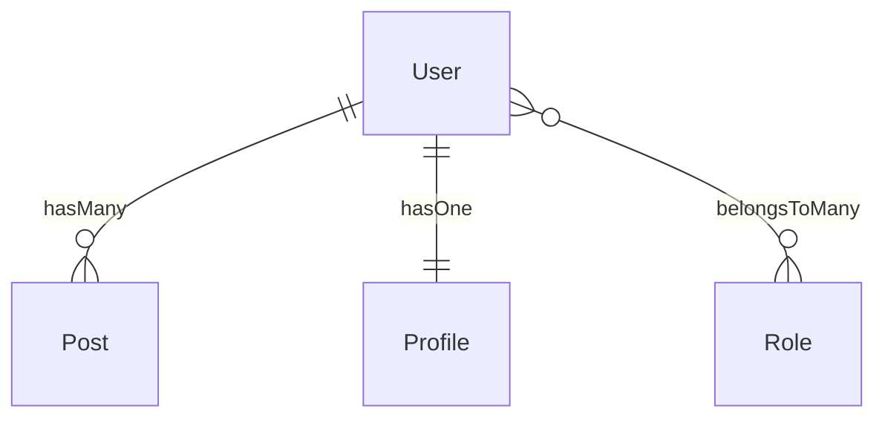

# Capyrel

**Intelligent Laravel scaffolding.** Reads your database schema and writes model relationships, controllers, API resources, form requests, and tests — automatically.

```bash
composer require julio/capyrel
```

> Supports Laravel 11 & 12 · PHP 8.2+ · MySQL · PostgreSQL · SQLite · MongoDB

---

## What it does

Capyrel reads your database (tables, columns, foreign keys, indexes) and reverse-engineers every Eloquent relationship. It then writes the code for you across your entire stack.

```bash
php artisan model:scaffold     # writes models, controllers, blade
php artisan model:map          # visual relationship diagram
php artisan model:resources    # generates API Resource classes
php artisan model:requests     # generates Form Request classes
php artisan model:tests        # generates Pest relationship tests
php artisan migrate:safe       # scans migrations for dangerous patterns
php artisan model:watch        # live-updates models when migrations change
```

---

## Installation

```bash
composer require julio/capyrel
```

Laravel's auto-discovery registers the service provider. No config publish required.

---

## Commands

### `model:scaffold`

Detects all relationships and scaffolds models, controllers, and blade views.

```bash
php artisan model:scaffold              # interactive wizard
php artisan model:scaffold User         # one model only
php artisan model:scaffold --dry-run    # preview without writing
php artisan model:scaffold --models     # models only
php artisan model:scaffold --controllers
php artisan model:scaffold --views
php artisan model:scaffold --force      # skip confirmations
php artisan model:scaffold --connection=pgsql
```

**What it writes to each model:**

```php
// capyrel: posts.user_id
public function posts(): HasMany
{
    return $this->hasMany(Post::class);
}

// capyrel: pivot: role_user
public function roles(): BelongsToMany
{
    return $this->belongsToMany(Role::class);
}
```

**What it writes to each controller:**

```php
public function index()
{
    $users = User::with(['posts', 'profile', 'roles'])->paginate(15);
    return view('users.index', compact('users'));
}
```

**What it adds to blade views:**

```blade
{{-- CAPYREL: hasMany → Post --}}
@forelse($user->posts as $post)
    {{-- $post->title --}}
@empty
    <p>No posts.</p>
@endforelse
```

---

### `model:map`

Generates a visual map of every model and relationship.

```bash
php artisan model:map                       # ASCII tree in terminal
php artisan model:map --format=mermaid      # Mermaid.js diagram
php artisan model:map --format=both
php artisan model:map --save=docs/schema.md
```

**ASCII output:**

```
User
├── hasMany          ──▶ Post
├── hasOne           ──▶ Profile
├── belongsToMany    ──▶ Role
└── hasManyThrough   ──▶ Comment  (via Post)
```

**Mermaid output** (paste into GitHub markdown or [mermaid.live](https://mermaid.live)):



---

### `model:resources`

Generates API Resource classes with `whenLoaded()` on all relationships — N+1 impossible by design.

```bash
php artisan model:resources
php artisan model:resources User
php artisan model:resources --force   # overwrite existing
php artisan model:resources --dry-run
```

**Generated `UserResource.php`:**

```php
public function toArray(Request $request): array
{
    return [
        'id'    => $this->id,
        'name'  => $this->name,
        'email' => $this->email,

        // capyrel: relationships — only included when eager-loaded
        'posts'   => PostResource::collection($this->whenLoaded('posts')),
        'profile' => new ProfileResource($this->whenLoaded('profile')),
        'roles'   => RoleResource::collection($this->whenLoaded('roles')),
    ];
}
```

---

### `model:requests`

Generates `Store` and `Update` Form Request classes with validation rules derived from column types, constraints, and naming conventions.

```bash
php artisan model:requests
php artisan model:requests Post
php artisan model:requests --force
php artisan model:requests --dry-run
```

**Generated `StorePostRequest.php`:**

```php
public function rules(): array
{
    return [
        'title'   => ['required', 'string', 'max:255'],
        'body'    => ['required', 'string'],
        'user_id' => ['required', 'integer', 'exists:users,id'],
        'slug'    => ['required', 'string', Rule::unique('posts', 'slug')],
    ];
}
```

Column → rule mapping: `varchar(255)` → `max:255`, `nullable` → removes `required`, `*_id` FK → `exists:table,id`, `unique index` → `Rule::unique()`, column named `email` → adds `email` rule, column named `*_url` → adds `url` rule.

---

### `model:tests`

Generates Pest test files for every detected relationship.

```bash
php artisan model:tests
php artisan model:tests User
php artisan model:tests --dry-run
php artisan model:tests --force
```

**Generated `tests/Models/UserTest.php`:**

```php
describe('User relationships', function () {
    it('User::posts() returns a HasMany', function () {
        expect((new User)->posts())->toBeInstanceOf(HasMany::class);
    });

    it('User::profile() returns a HasOne', function () {
        expect((new User)->profile())->toBeInstanceOf(HasOne::class);
    });

    it('User can attach Role', function () {
        $user = User::factory()->create();
        $role = Role::factory()->create();
        $user->roles()->attach($role->id);
        expect($user->fresh()->roles)->toHaveCount(1);
    })->skip('Requires factory and DB — remove skip() to enable');
});
```

Run with: `php artisan test --filter=relationships`

---

### `migrate:safe`

Scans pending migrations for dangerous patterns **before** running them.

```bash
php artisan migrate:safe          # scan + confirm + run
php artisan migrate:safe --check  # scan only, never runs
php artisan migrate:safe --force  # run without confirmation
```

**Patterns detected:**

| Pattern | Risk level |
|---|---|
| Adding NOT NULL column without default to existing table | Error |
| `Schema::drop()` / `Schema::dropIfExists()` | Error |
| `TRUNCATE` inside a migration | Error |
| `->dropColumn()` | Warning |
| `->unique()` on existing table | Warning |
| `->change()` column type | Warning |
| Column rename / table rename | Warning |
| Manual FK without index | Info |

---

### `model:watch`

Watches `database/migrations/` for changes and automatically injects new relationship methods into model files.

```bash
php artisan model:watch
php artisan model:watch --connection=mysql
php artisan model:watch --interval=3   # poll every 3 seconds
```

```
Capyrel Watch Mode
Watching database/migrations/
Polling every 2s · Press Ctrl+C to stop

✔ Initial scan complete — 18 relationships detected

[14:32:11] New migration: 2026_05_13_143211_add_team_id_to_posts.php
✔ Post: 1 new relationship(s) injected
  + belongsTo(Team) via posts.team_id
```

---

## Health check

Every `model:scaffold` run includes a full health check on your schema:

| Check | What it finds |
|---|---|
| N+1 risk | Relationship access inside loops in controllers |
| Missing index | FK columns with no index (full table scans) |
| Orphan FK | `_id` columns referencing tables that don't exist |
| Inverse missing | One-sided relationships (A→B exists, B→A doesn't) |
| Naming conflict | Generated method names clashing with existing ones |
| Soft-delete | `deleted_at` column without `SoftDeletes` trait |
| Eager depth | `hasManyThrough` chains 3+ levels deep |
| Circular dependency | Self-referential models that would loop on eager load |
| Cascade risk | FK constraints without `ON DELETE CASCADE` |
| Dead relationship | Relationships defined but never used anywhere |
| Fillable drift | `$fillable` columns that don't exist in the table |
| Morph registry | `morphTo` without `Relation::morphMap()` |

---

## Database support

| Database | Schema reading | FK detection | Index detection |
|---|---|---|---|
| MySQL | ✓ | ✓ | ✓ |
| PostgreSQL | ✓ | ✓ | ✓ |
| SQLite | ✓ | ✓ | ✓ |
| MongoDB | ✓ (document sampling + migration fallback) | ✓ (convention) | ✓ |

For MongoDB, capyrel samples live documents to discover field names. For empty collections, it falls back to reading your migration files.

---

## Requirements

- PHP 8.2+
- Laravel 11.x or 12.x

---

## License

MIT — see [LICENSE](LICENSE)
