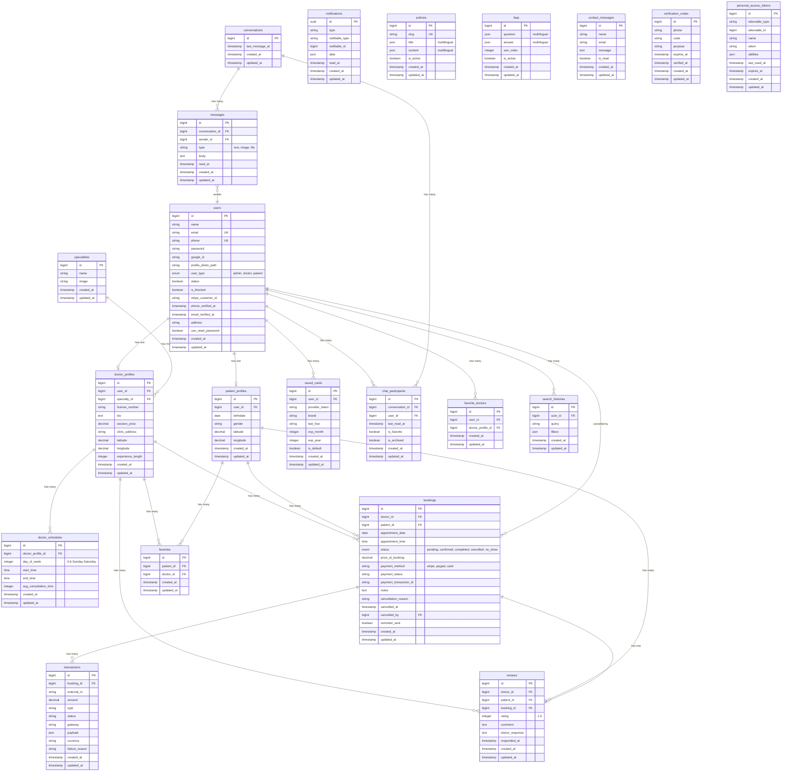

# 🏥 Doctor Appointment Mobile App - Backend

> A comprehensive Laravel 12 backend system for a Doctor Appointment Mobile Application that enables patients to book appointments with doctors, manage their health profiles, chat with healthcare providers, and process payments securely.

[](https://laravel.com)
[](https://php.net)
[](LICENSE)

---

## 📋 Table of Contents

- [Project Overview](#-project-overview)
- [Tech Stack](#-tech-stack)
- [Architecture](#-architecture)
- [Database Schema (ER Diagram)](#-database-schema-er-diagram)
- [Features](#-features)
- [API Documentation](#-api-documentation)
- [Project Structure](#-project-structure)
- [Installation & Setup](#-installation--setup)
- [Testing](#-testing)
- [User Roles](#-user-roles)
- [Current Implementation Status](#-current-implementation-status)

---

## 🎯 Project Overview

This is the **backend API** for a Doctor Appointment Mobile Application designed to connect patients with healthcare providers. The system provides:

- **Mobile API (RESTful)**: For patient-facing mobile applications
- **Admin Web Dashboard**: For system administrators to manage doctors, patients, policies, and FAQs
- **Doctor Web Dashboard**: For doctors to manage appointments, availability, chat with patients, and view reviews

### Core Business Logic

1. **Patient Registration & Verification**: Patients register with phone number, receive OTP for verification
2. **Doctor Discovery**: Patients can search/filter doctors by specialty, price, rating, location
3. **Appointment Booking**: Patients book appointments based on doctor availability slots
4. **Payment Processing**: Integrated with Stripe for secure payment handling
5. **Real-time Chat**: WebSocket-based chat between patients and doctors using Pusher
6. **Review System**: Patients can review doctors after completed appointments

---

## 🛠 Tech Stack

### Core Framework
| Technology | Version | Purpose |
|------------|---------|---------|
| **Laravel** | 12.0 | PHP Framework |
| **PHP** | 8.2+ | Server-side language |
| **MySQL/SQLite** | - | Database |

### Authentication & Authorization
| Package | Purpose |
|---------|---------|
| **Laravel Sanctum** | API Token Authentication |
| **Laravel Breeze** | Web Authentication (Admin/Doctor panels) |
| **Laravel Socialite** | Google OAuth Integration |

### Real-time & Payments
| Package | Purpose |
|---------|---------|
| **Pusher** | WebSocket for real-time chat |
| **Stripe PHP** | Payment processing |

### Frontend (Admin/Doctor Dashboards)
| Technology | Purpose |
|------------|---------|
| **Livewire 3** | Dynamic components |
| **Tailwind CSS** | Styling |
| **Alpine.js** | JavaScript framework |

### Development Tools
| Package | Purpose |
|---------|---------|
| **Laravel Telescope** | Debugging & Monitoring |
| **Laravel Pint** | Code formatting |
| **PHPUnit** | Testing |

---

## 🏗 Architecture

```
┌─────────────────────────────────────────────────────────────────┐
│                        CLIENT APPLICATIONS                       │
├─────────────────────┬─────────────────────┬─────────────────────┤
│   Mobile App        │   Admin Dashboard   │   Doctor Dashboard  │
│   (Patient)         │   (Web)             │   (Web)             │
│   REST API          │   Livewire/Blade    │   Livewire/Blade    │
└─────────────────────┴─────────────────────┴─────────────────────┘
                              │
                              ▼
┌─────────────────────────────────────────────────────────────────┐
│                         LARAVEL BACKEND                          │
├─────────────────────────────────────────────────────────────────┤
│  Routes: api.php (REST) │ web.php (Admin/Doctor)                │
├─────────────────────────────────────────────────────────────────┤
│  Middleware: auth:sanctum │ admin │ doctor │ verified           │
├─────────────────────────────────────────────────────────────────┤
│  Controllers: Api/* │ Admin/* │ Doctor/* │ Auth/*               │
├─────────────────────────────────────────────────────────────────┤
│  Models: User │ DoctorProfile │ PatientProfile │ Booking │ etc  │
└─────────────────────────────────────────────────────────────────┘
                              │
              ┌───────────────┴───────────────┐
              ▼                               ▼
┌─────────────────────────┐     ┌─────────────────────────┐
│       DATABASE          │     │    EXTERNAL SERVICES    │
│   MySQL / SQLite        │     │   Stripe │ Pusher       │
│   20 Tables             │     │   Google OAuth          │
└─────────────────────────┘     └─────────────────────────┘
```

---

## 📊 Database Schema (ER Diagram)



---

## ✨ Features

### 🔐 Authentication & Authorization

| Feature | Status | Description |
|---------|--------|-------------|
| Phone + Password Login | ✅ Done | Egypt phone format validation |
| OTP Verification | ✅ Done | 4-digit OTP for phone verification |
| Google OAuth | ✅ Done | Login/Register with Google |
| Password Reset | ✅ Done | OTP-based password recovery |
| Token-based Auth | ✅ Done | Laravel Sanctum for API |
| Role-based Access | ✅ Done | Admin, Doctor, Patient roles |

### 👨‍⚕️ Doctor Management

| Feature | Status | Description |
|---------|--------|-------------|
| Doctor Listing | ✅ Done | Paginated list with filters |
| Doctor Search | ✅ Done | By name, specialty |
| Doctor Filters | ✅ Done | By specialty, rating, price range |
| Doctor Sorting | ✅ Done | By rating, price, experience |
| Doctor Details | ✅ Done | Full profile with reviews |
| Doctor Availability | ✅ Done | Weekly schedule management |
| Availability Slots | ✅ Done | Auto-generated time slots |

### 📅 Booking System

| Feature | Status | Description |
|---------|--------|-------------|
| Create Booking | ✅ Done | Book appointment with doctor |
| View Bookings | ✅ Done | List patient/doctor bookings |
| Cancel Booking | ✅ Done | With cancellation reason |
| Reschedule Booking | ✅ Done | Change appointment time |
| Complete Booking | ✅ Done | Mark as completed (doctor) |
| Booking Reminders | ✅ Done | Reminder notification flag |

### 💳 Payment System

| Feature | Status | Description |
|---------|--------|-------------|
| Stripe Integration | ✅ Done | Secure payment processing |
| Saved Cards | ✅ Done | Store payment methods |
| Default Card | ✅ Done | Set default payment card |
| Transaction History | ✅ Done | Payment record keeping |

### 💬 Chat System

| Feature | Status | Description |
|---------|--------|-------------|
| Start Conversation | ✅ Done | Patient initiates with doctor |
| Send Messages | ✅ Done | Text messages |
| File Attachments | ✅ Done | Up to 50MB files |
| Real-time Updates | ✅ Done | Pusher WebSocket integration |
| Mark as Read | ✅ Done | Read receipts |
| Archive/Favorite | ✅ Done | Conversation organization |

### ⭐ Review System

| Feature | Status | Description |
|---------|--------|-------------|
| Submit Review | ✅ Done | After completed booking |
| Rating (1-5) | ✅ Done | Star rating system |
| Doctor Response | ✅ Done | Reply to reviews |
| Average Rating | ✅ Done | Calculated doctor rating |

### 🔔 Notifications

| Feature | Status | Description |
|---------|--------|-------------|
| Push Notifications | ✅ Done | Database notifications |
| Unread Count | ✅ Done | Badge counter support |
| Mark as Read | ✅ Done | Individual notification read |
| Notification Toggle | ✅ Done | Enable/disable notifications |

### 👤 Profile Management

| Feature | Status | Description |
|---------|--------|-------------|
| View Profile | ✅ Done | User details |
| Edit Profile | ✅ Done | Update name, email, phone |
| Change Password | ✅ Done | Secure password update |
| Delete Account | ✅ Done | Account removal |
| Profile Photo | ✅ Done | Avatar upload |

### 📋 Content Management (Admin)

| Feature | Status | Description |
|---------|--------|-------------|
| Policies (CRUD) | ✅ Done | Terms, Privacy Policy, etc. |
| FAQs (CRUD) | ✅ Done | Frequently Asked Questions |
| FAQ Reordering | ✅ Done | Drag & drop sort order |
| Multilingual Support | ✅ Done | JSON-based translations |
| Contact Messages | ✅ Done | User inquiries management |

### 🛡️ Admin Features

| Feature | Status | Description |
|---------|--------|-------------|
| Doctor Management | ✅ Done | Create, Edit, Block doctors |
| Patient Management | ✅ Done | View, Block patients |
| Booking Overview | ✅ Done | All bookings view |
| Notifications | ✅ Done | Admin notification center |

---

## 📚 API Documentation

### Base URL
```
Production: https://round8-backend-safarni-one.huma-volve.com/api
Local: http://localhost:8000/api
```

### Authentication Header
```
Authorization: Bearer <token>
```

### API Endpoints Summary

<details>
<summary><strong>🔐 Authentication</strong></summary>

| Method | Endpoint | Description |
|--------|----------|-------------|
| POST | `/auth/login` | Login with phone & password |
| POST | `/auth/register` | Register new patient |
| POST | `/auth/verify-otp` | Verify phone with OTP |
| POST | `/auth/resend-otp` | Resend OTP code |
| POST | `/auth/google-login` | Google OAuth login |
| POST | `/auth/google-register` | Google OAuth register |
| POST | `/auth/forget-password` | Request password reset OTP |
| PUT | `/auth/reset-password` | Reset password with OTP |

</details>

<details>
<summary><strong>👨‍⚕️ Doctors</strong></summary>

| Method | Endpoint | Description |
|--------|----------|-------------|
| GET | `/doctors` | List doctors (with filters) |
| GET | `/doctors/{id}` | Get doctor details |
| GET | `/doctors/{id}/availability` | Get availability slots |
| POST | `/doctors/{id}/favorite` | Toggle favorite doctor |

</details>

<details>
<summary><strong>📅 Bookings</strong></summary>

| Method | Endpoint | Description |
|--------|----------|-------------|
| GET | `/bookings` | List user bookings |
| POST | `/bookings` | Create new booking |
| GET | `/bookings/{id}` | Get booking details |
| POST | `/bookings/{id}/cancel` | Cancel booking |

</details>

<details>
<summary><strong>💬 Chat</strong></summary>

| Method | Endpoint | Description |
|--------|----------|-------------|
| GET | `/conversations` | List conversations |
| POST | `/conversations/start` | Start new conversation |
| GET | `/conversations/{id}` | Get messages |
| POST | `/conversations/{id}/messages` | Send message |
| POST | `/conversations/{id}/mark-read` | Mark as read |

</details>

<details>
<summary><strong>⭐ Reviews</strong></summary>

| Method | Endpoint | Description |
|--------|----------|-------------|
| POST | `/reviews` | Submit review |
| GET | `/reviews/doctor` | Get doctor's reviews |
| POST | `/reviews/doctor/{id}/reply` | Reply to review |
| GET | `/reviews/doctor/{doctor}` | Reviews for specific doctor |

</details>

<details>
<summary><strong>💳 Payments & Cards</strong></summary>

| Method | Endpoint | Description |
|--------|----------|-------------|
| POST | `/payments/process` | Process payment |
| GET | `/saved-cards` | List saved cards |
| POST | `/saved-cards` | Add new card |
| DELETE | `/saved-cards/{id}` | Remove card |
| PUT | `/saved-cards/{id}/default` | Set as default |

</details>

<details>
<summary><strong>🔔 Notifications</strong></summary>

| Method | Endpoint | Description |
|--------|----------|-------------|
| GET | `/notifications` | List all notifications |
| GET | `/notifications/unread` | List unread only |
| POST | `/notifications/{id}/read` | Mark as read |

</details>

<details>
<summary><strong>👤 Profile</strong></summary>

| Method | Endpoint | Description |
|--------|----------|-------------|
| GET | `/user` | Get current user |
| GET | `/profile/show` | Get profile details |
| POST | `/profile/edit` | Update profile |
| PUT | `/profile/change-password` | Change password |
| DELETE | `/profile/delete` | Delete account |
| GET | `/profile/favorites` | List favorite doctors |
| POST | `/profile/logout` | Logout user |

</details>

<details>
<summary><strong>📋 Support Content</strong></summary>

| Method | Endpoint | Description |
|--------|----------|-------------|
| GET | `/policies` | List all policies |
| GET | `/faqs` | List all FAQs |
| POST | `/contact-us` | Submit contact message |

</details>

> 📄 **Full API Documentation**: See [API_DOCUMENTATION.md](API_DOCUMENTATION.md) for detailed request/response examples.

---

## 📁 Project Structure

```
├── app/
│   ├── Http/
│   │   ├── Controllers/
│   │   │   ├── Admin/           # Admin panel controllers
│   │   │   │   ├── AdminBookingController.php
│   │   │   │   ├── AdminContactMessageController.php
│   │   │   │   ├── AdminPatientController.php
│   │   │   │   ├── DoctorController.php
│   │   │   │   ├── NotificationController.php
│   │   │   │   └── SupportContentController.php
│   │   │   ├── Api/             # Mobile API controllers
│   │   │   │   ├── Auth/        # Authentication controllers
│   │   │   │   ├── Profile/     # Profile management
│   │   │   │   ├── BookingController.php
│   │   │   │   ├── ChatController.php
│   │   │   │   ├── DoctorController.php
│   │   │   │   ├── PaymentController.php
│   │   │   │   ├── ReviewController.php
│   │   │   │   └── ...
│   │   │   └── Doctor/          # Doctor panel controllers
│   │   │       ├── AvailabilityController.php
│   │   │       ├── ChatController.php
│   │   │       ├── DoctorBookingController.php
│   │   │       └── ...
│   │   └── Middleware/
│   └── Models/                  # Eloquent Models (20 models)
│       ├── User.php
│       ├── DoctorProfile.php
│       ├── PatientProfile.php
│       ├── Booking.php
│       ├── Conversation.php
│       ├── Message.php
│       ├── Review.php
│       └── ...
├── database/
│   ├── migrations/              # 27 migration files
│   └── seeders/                 # 15 seeder files
├── routes/
│   ├── api.php                  # REST API routes
│   ├── web.php                  # Web routes (Admin/Doctor)
│   └── auth.php                 # Authentication routes
├── resources/views/
│   ├── admin/                   # Admin dashboard views
│   ├── doctor/                  # Doctor dashboard views
│   └── layouts/                 # Layout templates
└── tests/
    └── Feature/                 # Feature tests
        ├── Auth/
        ├── Chat/
        ├── BookingTest.php
        ├── PaymentTest.php
        └── ...
```

---

## 🚀 Installation & Setup

### Prerequisites
- PHP 8.2+
- Composer
- Node.js & NPM
- MySQL or SQLite

### Quick Setup

```bash
# 1. Clone the repository
git clone https://github.com/Huma-volve/Huma-volve-huma-volve-round8-backend-team-one.git
cd Huma-volve-huma-volve-round8-backend-team-one

# 2. Run the setup script (handles everything)
composer setup
```

### Manual Setup

```bash
# Install PHP dependencies
composer install

# Copy environment file
cp .env.example .env

# Generate application key
php artisan key:generate

# Run migrations
php artisan migrate

# Seed the database (optional)
php artisan db:seed

# Install frontend dependencies
npm install

# Build assets
npm run build
```

### Development Server

```bash
# Run all services concurrently (recommended)
composer dev

# Or run individually:
php artisan serve          # Laravel server
php artisan queue:listen   # Queue worker
npm run dev               # Vite dev server
```

### Environment Variables

```env
# Database
DB_CONNECTION=mysql
DB_HOST=127.0.0.1
DB_PORT=3306
DB_DATABASE=doctor_appointment
DB_USERNAME=root
DB_PASSWORD=

# Pusher (Real-time Chat)
PUSHER_APP_ID=your_app_id
PUSHER_APP_KEY=your_app_key
PUSHER_APP_SECRET=your_app_secret
PUSHER_APP_CLUSTER=eu

# Stripe (Payments)
STRIPE_KEY=pk_test_xxx
STRIPE_SECRET=sk_test_xxx

# Google OAuth
GOOGLE_CLIENT_ID=your_client_id
GOOGLE_CLIENT_SECRET=your_client_secret
```

---

## 🧪 Testing

```bash
# Run all tests
composer test

# Or directly with PHPUnit
php artisan test

# Run specific test file
php artisan test --filter=BookingTest

# Run with coverage
php artisan test --coverage
```

### Test Coverage

| Category | Tests |
|----------|-------|
| Authentication | LoginTest, RegisterTest, OtpTest, PasswordResetTest |
| Bookings | BookingTest, BookingSlotTest |
| Payments | PaymentTest, SavedCardTest |
| Chat | ChatTest, ConversationTest |
| Profile | ProfileTest |
| Admin | AdminPanelTest |
| Contact | ContactMessageTest |

---

## 👥 User Roles

### 1. Patient (Mobile App)
- Register/Login via phone or Google
- Browse and search doctors
- Book appointments
- Make payments
- Chat with doctors
- Leave reviews
- Manage profile and favorites

### 2. Doctor (Web Dashboard)
- Manage availability schedule
- View and manage bookings (accept, cancel, complete, reschedule)
- Chat with patients
- Respond to reviews
- View patient history
- Access booking reports

### 3. Admin (Web Dashboard)
- Manage doctors (CRUD, block/unblock)
- Manage patients (view, block/unblock)
- Manage policies and FAQs
- View all bookings
- Manage contact messages
- System notifications

### Default Test Accounts

| Role | Phone | Password |
|------|-------|----------|
| Admin | +201000000001 | password |
| Doctor | +201000000002 | password |
| Patient | +201099999999 | Demo@123 |

---

## 📈 Current Implementation Status

### ✅ Completed Features

| Module | Completion |
|--------|------------|
| Authentication (API) | 100% |
| Doctor Management | 100% |
| Booking System | 100% |
| Payment Integration | 100% |
| Chat System | 100% |
| Review System | 100% |
| Notification System | 100% |
| Profile Management | 100% |
| Admin Dashboard | 100% |
| Doctor Dashboard | 100% |
| Policies & FAQs | 100% |
| Contact Messages | 100% |

### 🔄 Potential Enhancements (Future)

- [ ] Video consultation integration
- [ ] Prescription management
- [ ] Medical records upload
- [ ] Doctor verification system
- [ ] Advanced analytics dashboard
- [ ] Multi-currency support
- [ ] Push notifications (FCM)
- [ ] Appointment calendar sync

---

## 🔗 Related Resources

- **Postman Collection**: [huma-volve-backend.postman_collection.json](huma-volve-backend.postman_collection.json)
- **API Documentation**: [API_DOCUMENTATION.md](API_DOCUMENTATION.md)
- **SRS Document**: [Software Requirements Specification (SRS) for Doctor Appointment Mobile App.pdf](Software%20Requirements%20Specification%20(SRS)%20for%20Doctor%20Appointment%20Mobile%20App.pdf)

---

## 📄 License

This project is licensed under the MIT License.

---

## 👨‍💻 Development Team

**Huma-volve Round 8 - Backend Team One**

---

> Made with ❤️ using Laravel 12
