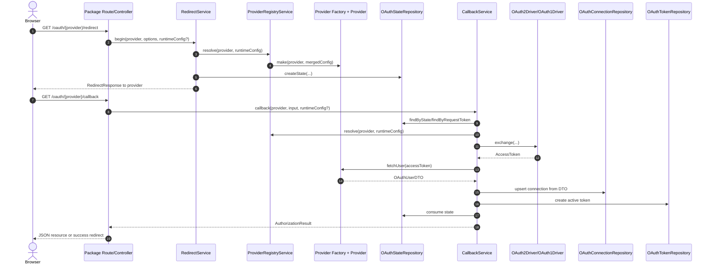

# jooservices/laravel-oauth

Protocol-first Laravel OAuth package with MongoDB-backed persistence.

This package owns its OAuth runtime internally. It does not wrap Socialite or `league/oauth*` clients. It provides a package-managed OAuth surface for browser flows, connection management, CLI-assisted authorization, and provider API access.

Built-in providers today:

- Flickr over OAuth 1.0a
- Tumblr over OAuth 1.0a
- GitHub over OAuth 2.0
- GitLab over OAuth 2.0

## What This Package Is For

Use this package when you need to:

- start OAuth redirect flows from package routes or the programmatic API
- complete callbacks and persist linked provider accounts
- store connections, tokens, and temporary state in MongoDB
- support multiple linked accounts for the same provider and owner
- access provider APIs with authenticated package-managed clients
- support CLI-assisted OAuth1 or OAuth2 device flows where the provider allows them

`user_id` is an opaque external owner reference. The package does not assume or require a local Laravel `User` model relationship.

## What It Does Not Do

- no OpenID Connect discovery, ID token validation, nonce handling, or claims-specific behavior
- no provider auto-discovery
- no app-only authentication such as GitHub App JWT or installation-token flows
- no automatic token refresh execution; refresh must be called explicitly
- no SQL persistence adapter; current persistence is MongoDB-only
- no third-party OAuth runtime libraries

## Package Surface

### HTTP routes

When `laravel-oauth.routes.enabled` is `true`, the package registers:

- `GET /oauth/{provider}/redirect`
- `GET|POST /oauth/{provider}/callback`
- `GET /api/v1/oauth/{provider}/connections`
- `POST /api/v1/oauth/{provider}/connections/{connection}/default`
- `DELETE /api/v1/oauth/{provider}/connections/{connection}`

Browser redirect and callback stay on the `web` middleware group. Connection APIs stay on the `api` middleware group.

### Artisan commands

- `php artisan oauth:authorize-cli` for OAuth1 CLI entry points
- `php artisan oauth:complete-cli` for OAuth1 verifier completion
- `php artisan oauth:device-authorize` for OAuth2 device authorization
- `php artisan oauth:device-complete` for OAuth2 device completion
- `php artisan oauth:make-provider` for provider scaffolding

### Programmatic API

The main entry point is `JOOservices\LaravelOAuth\Core\OAuthManager`.

```php
use JOOservices\LaravelOAuth\Core\OAuthManager;

$resolved = app(OAuthManager::class)->driver('github');

$redirect = $resolved->redirect([
    'user_id' => 'account-123',
    'flow_type' => 'connect',
]);
```

## Requirements

- PHP 8.5+
- Laravel 12
- MongoDB PHP extension
- reachable MongoDB instance

## Install

```bash
composer require jooservices/laravel-oauth
```

Publish config if you want to override package defaults:

```bash
php artisan vendor:publish --tag=laravel-oauth-config
```

## Minimal Configuration

```dotenv
LARAVEL_OAUTH_DB_CONNECTION=mongodb
MONGODB_URI=mongodb://localhost:27017
MONGODB_DATABASE=jooservices_oauth
```

Configure the providers you actually use.

### Flickr

```dotenv
FLICKR_CLIENT_ID=your-flickr-key
FLICKR_CLIENT_SECRET=your-flickr-secret
FLICKR_CALLBACK_URL=https://your-app.test/oauth/flickr/callback
```

### Tumblr

```dotenv
TUMBLR_CLIENT_ID=your-tumblr-consumer-key
TUMBLR_CLIENT_SECRET=your-tumblr-consumer-secret
TUMBLR_CALLBACK_URL=https://your-app.test/oauth/tumblr/callback
```

### GitHub

```dotenv
GITHUB_CLIENT_ID=your-github-client-id
GITHUB_CLIENT_SECRET=your-github-client-secret
GITHUB_CALLBACK_URL=https://your-app.test/oauth/github/callback
GITHUB_API_VERSION=2022-11-28
GITHUB_USE_PKCE=true
GITHUB_SUPPORTS_REFRESH_TOKENS=true
```

### GitLab

```dotenv
GITLAB_CLIENT_ID=your-gitlab-client-id
GITLAB_CLIENT_SECRET=your-gitlab-client-secret
GITLAB_CALLBACK_URL=https://your-app.test/oauth/gitlab/callback
GITLAB_BASE_URI=https://gitlab.com
GITLAB_API_BASE_URI=https://gitlab.com/api/v4
GITLAB_USE_PKCE=true
GITLAB_SUPPORTS_REFRESH_TOKENS=true
```

The source-of-truth configuration file is `config/laravel-oauth.php`.

## Quick Start

Start a browser flow:

```http
GET /oauth/github/redirect?user_id=account-123&flow_type=connect
```

Or for OAuth1:

```http
GET /oauth/flickr/redirect?user_id=account-123&permissions[]=write&flow_type=connect
```

The package will:

1. resolve the provider from config
2. create a temporary `oauth_states` record
3. redirect the browser to the provider
4. exchange callback credentials for an access token
5. fetch the provider profile
6. persist `oauth_connections` and `oauth_tokens`

List linked accounts for an external owner:

```http
GET /api/v1/oauth/github/connections?user_id=account-123
```

Set a default connection:

```http
POST /api/v1/oauth/github/connections/{connectionId}/default
Content-Type: application/json

{"user_id":"account-123"}
```

Delete a connection:

```http
DELETE /api/v1/oauth/github/connections/{connectionId}
Content-Type: application/json

{"user_id":"account-123"}
```

## Current Provider Notes

- Flickr supports browser flow and true OAuth1 OOB CLI completion.
- Tumblr supports browser flow and browser-assisted OAuth1 CLI flow, not OOB.
- GitHub supports browser flow and device flow.
- GitLab supports browser flow only.
- OAuth1 providers in this package do not support refresh tokens.
- OAuth2 refresh is explicit through `$resolved->refresh($token)` and only works when a refresh token exists.

## Verification Commands

```bash
composer lint
composer test
composer test:live
composer test:coverage
composer ci
```

There is no checked-in CI workflow file in this repository at the moment. Treat `composer ci` as the local quality gate.

## Docs Map

- `docs/README.md` for the docs index and reading order
- `docs/01-getting-started/quick-start.md` for installation and first success
- `docs/02-user-guide/user-guide.md` for routes, callback behavior, API usage, and CLI flows
- `docs/03-providers/` for provider-specific setup and limitations
- `docs/04-development/` for architecture, contributor workflow, provider extension, and AI guidance
- `docs/05-risks-and-gaps.md` for truthful limitations

## Source-Of-Truth Rule

Source code is the source of truth in this repository. `plan.md` is a planning artifact and contains future-state material that is not shipped. Do not treat it as current documentation.
		'state' => $state,
	]);
```

Sequence flow from redirect to DTO generation:



## Quick usage

Start a Flickr connect flow:

```http
GET /oauth/flickr/redirect?user_id=account-123&permissions[]=write&flow_type=connect
```

Start a GitHub connect flow:

```http
GET /oauth/github/redirect?user_id=account-123&flow_type=connect
```

Start a GitLab connect flow:

```http
GET /oauth/gitlab/redirect?user_id=account-123&permissions[]=read_user&flow_type=connect
```

Start a Tumblr connect flow:

```http
GET /oauth/tumblr/redirect?user_id=account-123&permissions[]=read&flow_type=connect
```

That call:

1. Requests a provider-specific authorization start token or authorization URL.
2. Persists callback correlation in `oauth_states`.
3. Redirects the browser to the provider authorization screen.

After the user authorizes on Flickr, Flickr calls back to:

```http
GET /oauth/flickr/callback?oauth_token=...&oauth_verifier=...
```

The callback handler then:

1. Restores the stored state by request token.
2. Exchanges the temporary token for an access token.
3. Fetches the Flickr profile.
4. Upserts one `oauth_connections` document.
5. Writes one active `oauth_tokens` document.
6. Deletes the consumed `oauth_states` document.

Default JSON callback response shape:

```json
{
	"connection_id": "7f9f1f6f-0e75-4f61-ae5d-0c4e7c9988c5",
	"provider": "flickr",
	"provider_account_id": "11111@N01",
	"response_mode": "json",
	"flow_type": "connect",
	"granted_permissions": ["read"],
	"profile": {
		"provider": "flickr",
		"provider_user_id": "11111@N01",
		"username": "demo-user-one",
		"name": "demo-user-one",
		"nickname": "demo-user-one",
		"email": null,
		"avatar": null,
		"raw": {
			"stat": "ok"
		}
	},
	"token": {
		"provider": "flickr",
		"token": "access-token-1",
		"token_secret": "access-secret-1",
		"refresh_token": null,
		"expires_at": null,
		"scopes": [],
		"granted_permissions": ["read"],
		"raw": {
			"oauth_token": "access-token-1",
			"oauth_token_secret": "access-secret-1"
		}
	}
}
```

List linked Flickr accounts for an external owner:

```http
GET /api/v1/oauth/flickr/connections?user_id=account-123
```

List linked Tumblr accounts for an external owner:

```http
GET /api/v1/oauth/tumblr/connections?user_id=account-123
```

List linked GitHub accounts for an external owner:

```http
GET /api/v1/oauth/github/connections?user_id=account-123
```

List linked GitLab accounts for an external owner:

```http
GET /api/v1/oauth/gitlab/connections?user_id=account-123
```

Switch the default Flickr account:

```http
POST /api/v1/oauth/flickr/connections/{connectionId}/default
Content-Type: application/json

{
	"user_id": "account-123"
}
```

## Evidence

Local verification completed against MongoDB `jooservices_oauth` on `mongodb://localhost:27017`.

Verified outcomes:

- redirect flow persists `oauth_states`
- callback flow persists `oauth_connections` and `oauth_tokens`
- same external owner can link multiple Flickr accounts
- same external owner can link multiple Tumblr accounts
- default account switching works
- GitHub OAuth2 web flow persists connections and refresh-capable token data
- GitLab OAuth2 web flow persists connections and refresh-capable token data
- GitHub device flow works through dedicated CLI commands
- Flickr CLI uses OOB verifier mode; Tumblr CLI uses browser-callback mode and can wait for callback completion

Interpretation:

- the default automated suite is green
- live verification remains opt-in through `composer test:live`
- registry coverage now includes config-driven factory resolution for built-in OAuth1 and OAuth2 providers

The main mocked integration coverage is in [tests/Integration/Flickr/FlickrOAuthFlowTest.php](tests/Integration/Flickr/FlickrOAuthFlowTest.php). The opt-in live verification is in [tests/Integration/Flickr/FlickrLiveApiTest.php](tests/Integration/Flickr/FlickrLiveApiTest.php).

## Development

```bash
composer lint
composer lint:fix
composer test
composer ci
```

Coverage report:

```bash
composer test:coverage
```

Use the coverage command above for the current local percentage.

## Extending Providers

The current extension seam is explicit and config-driven.

To add a provider cleanly:

1. Add a provider namespace folder under `src/Providers/OAuth1/{ProviderName}` or `src/Providers/OAuth2/{ProviderName}` using folder-scoped role names such as `Provider`, `Factory`, `ApiClient`, `Server`, and `UserMapper` when they apply.
2. Prefer the shared provider-family seams for standard providers: `AbstractStandardOAuth1Factory`, `AbstractStandardOAuth2Factory`, `AbstractStandardOAuth1Provider`, `AbstractStandardOAuth2Provider`, and shared `OAuth1Config` or `OAuth2Config`.
3. Register the factory under `laravel-oauth.providers.{name}.factory` in config.
4. Keep protocol mechanics in shared protocol/core layers rather than burying them in services.
5. Add registry coverage plus the smallest relevant flow test before claiming support.

Provider scaffolds for quick copy/paste live in:

- [docs/example-oauth1-scaffold.md](docs/example-oauth1-scaffold.md)
- [docs/example-oauth2-scaffold.md](docs/example-oauth2-scaffold.md)

This means adding a provider is easier than before, but it is still an explicit integration step, not provider auto-discovery.

Live sandbox helper:

```bash
./scripts/flickr-live-browser.sh --mode web
./scripts/flickr-live-browser.sh --mode cli
./scripts/tumblr-live-browser.sh
./scripts/github-live-browser.sh --mode web
./scripts/github-live-browser.sh --mode device
./scripts/gitlab-live-browser.sh
```

The helpers support Flickr browser plus CLI OOB flow, Tumblr browser callback flow, GitHub browser plus device flow, and GitLab browser callback flow. Detailed usage is documented in [sandbox/README.md](sandbox/README.md).

## Docs

- [docs/README.md](docs/README.md) — reading order and index
- [docs/01-getting-started/quick-start.md](docs/01-getting-started/quick-start.md) — installation and first auth flow
- [docs/02-user-guide/user-guide.md](docs/02-user-guide/user-guide.md) — full route reference, API, CLI
- [docs/02-user-guide/troubleshooting.md](docs/02-user-guide/troubleshooting.md) — common errors, debugging
- [docs/00-architecture/architecture-overview.md](docs/00-architecture/architecture-overview.md) — architecture, data model
- [docs/04-development/development.md](docs/04-development/development.md) — testing, lint, CI workflow
- [docs/04-development/add-provider.md](docs/04-development/add-provider.md) — add a custom provider
- [docs/04-development/ai-contributor-guide.md](docs/04-development/ai-contributor-guide.md) — AI contributor rules
- [docs/05-risks-and-gaps.md](docs/05-risks-and-gaps.md) — limitations and gaps
- Provider docs: [flickr](docs/03-providers/flickr.md) · [tumblr](docs/03-providers/tumblr.md) · [github](docs/03-providers/github.md) · [gitlab](docs/03-providers/gitlab.md)