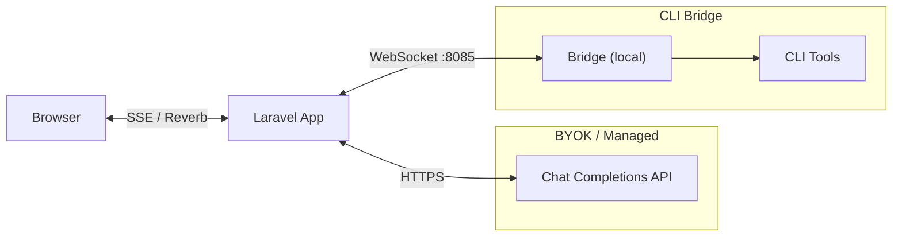

# Laravel AI Bridge

[](https://packagist.org/packages/tetrixdev/laravel-ai-bridge)
[](LICENSE)
[](https://php.net)
[](https://laravel.com)

A unified AI streaming interface for Laravel. Connect any Chat Completions-compatible provider (OpenAI, Anthropic, Groq, Ollama, etc.) or local CLI tools (Codex, Claude, Gemini) to your app through a single, normalized streaming pipeline.

## What is this?

Laravel AI Bridge provides a unified streaming pipeline: **provider -> normalized events -> browser**. No matter where the AI response originates, your application receives the same `StreamEvent` objects through the same callback API. Three modes of operation cover every use case:

- **BYOK (Bring Your Own Key)** -- User provides an API key and endpoint. No local install needed.
- **Managed** -- Your app provides the API key. Same code path as BYOK, different config source.
- **CLI Bridge** -- User runs `npx @tetrixdev/ai-bridge` locally. Their CLI tools (Codex, Claude, Gemini) connect to your app via a dedicated WebSocket server.

## Installation

```bash
composer require tetrixdev/laravel-ai-bridge
```

Publish the config file:

```bash
php artisan vendor:publish --tag=ai-bridge-config
```

Publish the JavaScript client (optional):

```bash
php artisan vendor:publish --tag=ai-bridge-js
```

Add to your `.env`:

```env
# Required for all modes
AI_BRIDGE_TOKEN_SECRET=your-random-secret-here

# For BYOK / Managed mode
AI_BRIDGE_MODE=byok
AI_BRIDGE_ENDPOINT=https://api.openai.com
AI_BRIDGE_API_KEY=sk-...
AI_BRIDGE_MODEL=gpt-4o

# For CLI Bridge mode
AI_BRIDGE_MODE=bridge
AI_BRIDGE_SERVER_HOST=0.0.0.0
AI_BRIDGE_SERVER_PORT=8085
```

## Quick Start

A minimal BYOK example in three steps.

### 1. Configure `.env`

```env
# Generate with: openssl rand -hex 32
AI_BRIDGE_TOKEN_SECRET=REPLACE_WITH_OUTPUT_OF_openssl_rand_hex_32
AI_BRIDGE_MODE=byok
AI_BRIDGE_ENDPOINT=https://api.openai.com
AI_BRIDGE_API_KEY=sk-your-key
AI_BRIDGE_MODEL=gpt-4o
```

### 2. Create a Controller

```php
<?php

namespace App\Http\Controllers;

use Illuminate\Http\Request;
use Illuminate\Support\Str;
use Tetrix\AiBridge\Facades\AiBridge;

class ChatController extends Controller
{
    public function stream(Request $request)
    {
        // NOTE (UX-001): conversation_id must stay CONSTANT across all messages in the
        // same conversation. Generating a new ID on every request (e.g. uniqid()) creates
        // a brand-new conversation each time, so the AI has no memory of previous messages.
        // Store the ID in the session and reuse it for follow-up messages.
        $conversationId = $request->input('conversation_id')
            ?? $request->session()->get('ai_conversation_id')
            ?? 'conv-' . Str::uuid();
        $request->session()->put('ai_conversation_id', $conversationId);

        return AiBridge::streamToResponse(
            conversationId: $conversationId,
            message: $request->input('message'),
            options: [
                'system_prompt' => 'You are a helpful assistant.',
            ],
        );
    }
}
```

### 3. Create a Blade View

```html
<div id="chat">
    <div id="messages"></div>
    <div id="loading" style="display:none; color: grey;">AI is thinking...</div>
    <div id="error" style="color: red; display: none;"></div>
    <input type="text" id="input" placeholder="Type a message...">
    <button id="send-btn" onclick="send()">Send</button>
</div>

<script src="/js/vendor/ai-bridge.js"></script>
<script>
// NOTE (UX-003): crypto.randomUUID() requires a secure context (HTTPS or localhost).
// Over plain HTTP on a LAN IP (common for staging / internal testing) it throws a
// TypeError and breaks the whole page. This helper falls back to a Math.random()-based
// ID generator so conversation IDs work everywhere.
function generateId() {
    if (typeof crypto !== 'undefined' && typeof crypto.randomUUID === 'function') {
        return crypto.randomUUID();
    }
    // Fallback for non-secure contexts (plain HTTP). Not cryptographically strong,
    // but sufficient for uniquely identifying a conversation in the browser.
    return 'xxxxxxxx-xxxx-4xxx-yxxx-xxxxxxxxxxxx'.replace(/[xy]/g, (c) => {
        const r = (Math.random() * 16) | 0;
        const v = c === 'x' ? r : (r & 0x3) | 0x8;
        return v.toString(16);
    });
}

// NOTE (UX-001): Generate conversationId ONCE at page load and reuse it for all
// messages in this conversation. Regenerating on each send() creates a fresh
// conversation every time and the AI loses all context from previous messages.
const conversationId = 'conv-' + generateId();

const stream = new AiBridgeStream({
    mode: 'sse',
    url: '/ai-bridge/stream/sse',
});

// SEC: Use textContent instead of innerHTML — AI-generated content is untrusted
// and must not be inserted as raw HTML. If you need markdown rendering, use
// a sanitizer such as DOMPurify: el.innerHTML = DOMPurify.sanitize(rendered)
stream.on('text', (content) => {
    const el = document.getElementById('messages');
    el.textContent += content;
});

stream.on('done', () => {
    document.getElementById('messages').textContent += '\n\n';
    document.getElementById('loading').style.display = 'none';
    document.getElementById('send-btn').disabled = false;
    document.getElementById('input').disabled = false;
});

// UX-008: Also handle cancelled so UI is never left stuck after destroy() or cancellation
stream.on('cancelled', () => {
    document.getElementById('loading').style.display = 'none';
    document.getElementById('send-btn').disabled = false;
    document.getElementById('input').disabled = false;
});

stream.on('error', (code, message) => {
    const el = document.getElementById('error');
    el.textContent = `Error: ${message}`;
    el.style.display = 'block';
    document.getElementById('loading').style.display = 'none';
    document.getElementById('send-btn').disabled = false;
    document.getElementById('input').disabled = false;
});

function send() {
    const input = document.getElementById('input');
    if (!input.value.trim()) return;

    // Disable input during streaming and show loading indicator (UX-008)
    document.getElementById('send-btn').disabled = true;
    input.disabled = true;
    document.getElementById('loading').style.display = 'block';
    document.getElementById('error').style.display = 'none';

    // NOTE (UX-001): The conversation_id must remain STABLE across all messages in the
    // same conversation so the AI can remember the context. Generate it ONCE when the
    // page loads and reuse it for every send() call in this conversation session.
    // Using Date.now() here would create a new conversation on every message.
    stream.send({ message: input.value, conversation_id: conversationId });
    input.value = '';
}
</script>
```

## Modes of Operation

### BYOK (Bring Your Own Key)

The user provides an API key and endpoint for any Chat Completions-compatible provider. The server calls the API directly -- no local install required on the user's machine.

```php
$stream = AiBridge::stream('conv-1', 'Hello!', [
    'mode' => 'byok',
    'api_key' => $user->ai_api_key,        // per-user key
    'endpoint' => 'https://api.openai.com',
    'model' => 'gpt-4o',
    'system_prompt' => 'You are a game master.',
]);

$stream->onBlockDelta(fn ($event) => $this->appendToChat($event->data['content']));
$stream->onDone(fn ($usage) => $this->logUsage($usage));
$stream->start();
```

Works with any Chat Completions-compatible endpoint: OpenAI, Anthropic (via proxy), Groq, Together, Ollama, LM Studio, vLLM, etc.

### Managed

Identical to BYOK but the application provides its own API key. Users pay the app a subscription fee. No separate architecture needed -- same code path, different config source.

```env
AI_BRIDGE_MODE=managed
AI_BRIDGE_ENDPOINT=https://api.openai.com
AI_BRIDGE_API_KEY=sk-your-app-key
AI_BRIDGE_MODEL=gpt-4o
```

```php
// No per-user key needed -- uses the app's configured key
$stream = AiBridge::stream('conv-1', 'Hello!', [
    'system_prompt' => 'You are a helpful assistant.',
]);
$stream->start();
```

### CLI Bridge

The user installs the bridge locally via `npx @tetrixdev/ai-bridge`. It connects to your app's dedicated WebSocket server and proxies AI requests through their local CLI tools (using their existing subscriptions).

```env
AI_BRIDGE_MODE=bridge
AI_BRIDGE_TOKEN_SECRET=your-secret
AI_BRIDGE_SERVER_PORT=8085
```

Start the bridge server:

```bash
php artisan ai-bridge:serve
```

Generate a token for the user, then have them connect:

```bash
php artisan ai-bridge:token --user-id=42

# User runs on their machine:
npx @tetrixdev/ai-bridge --server=ws://yourapp.com:8085 --token=<JWT>
```

The server-side code is identical:

```php
$stream = AiBridge::stream('conv-1', 'Hello!', [
    'user_id' => $user->id,
]);
$stream->onBlockDelta(fn ($event) => echo $event->data['content']);
$stream->start();
```

## Configuration

Full reference for `config/ai-bridge.php`:

| Key | Env Variable | Default | Description |
|-----|-------------|---------|-------------|
| `mode` | `AI_BRIDGE_MODE` | `byok` | Active mode: `byok`, `managed`, or `bridge` |
| `token.secret` | `AI_BRIDGE_TOKEN_SECRET` | `null` | JWT signing secret (required) |
| `token.ttl` | `AI_BRIDGE_TOKEN_TTL` | `86400` | Token TTL in seconds (24h) |
| `websocket.heartbeat_interval` | -- | `30` | Seconds between ping/pong |
| `websocket.request_timeout` | -- | `300` | Seconds before AI request timeout |
| `chat_completions.endpoint` | `AI_BRIDGE_ENDPOINT` | `null` | Chat Completions API base URL |
| `chat_completions.api_key` | `AI_BRIDGE_API_KEY` | `null` | API key for BYOK/managed |
| `chat_completions.model` | `AI_BRIDGE_MODEL` | `null` | Model name (e.g. `gpt-4o`) |
| `chat_completions.max_tokens` | `AI_BRIDGE_MAX_TOKENS` | `4096` | Max response tokens |
| `chat_completions.allowed_models` | -- | `[]` | Model allowlist. Empty array allows all models. When non-empty, requests for a model not in the list are rejected with HTTP 422 |
| `server.host` | `AI_BRIDGE_SERVER_HOST` | `127.0.0.1` | Bridge WebSocket server bind address (set to `0.0.0.0` in Docker/multi-host setups) |
| `server.port` | `AI_BRIDGE_SERVER_PORT` | `8085` | Bridge WebSocket server port |
| `broadcasting.enabled` | `AI_BRIDGE_BROADCAST` | `true` | Enable Reverb broadcasting |
| `broadcasting.connection` | `AI_BRIDGE_BROADCAST_CONNECTION` | `reverb` | Broadcasting connection name |
| `streaming.suppress_thinking_blocks` | `AI_BRIDGE_SUPPRESS_THINKING` | `true` | Suppress AI chain-of-thought / thinking blocks from SSE and broadcast output. Set to `false` only when intentionally displaying AI reasoning to users. |

## Streaming to Browser

Two methods for delivering AI responses to the browser.

### SSE (Server-Sent Events)

Returns an SSE HTTP response. Simplest approach -- no extra infrastructure needed.

```php
// In your controller
public function stream(Request $request)
{
    return AiBridge::streamToResponse(
        conversationId: $request->input('conversation_id'),
        message: $request->input('message'),
        options: [
            'system_prompt' => $request->input('system_prompt', ''),
        ],
    );
}
```

Or use the built-in endpoint:

```
POST /ai-bridge/stream/sse
Content-Type: application/json

{
    "conversation_id": "conv-123",
    "message": "Hello!",
    "system_prompt": "You are a helpful assistant."
}
```

The response is `text/event-stream` with normalized events. The first event is always
`conversation_id`, carrying the server-generated conversation ID — capture it and send it
back with follow-up messages to continue a multi-turn conversation:

```
data: {"event":"conversation_id","data":{"conversation_id":"conv-123"}}

data: {"event":"block_start","data":{"block_type":"text","block_index":0}}

data: {"event":"block_delta","data":{"block_type":"text","block_index":0,"content":"Hello"}}

data: {"event":"block_delta","data":{"block_type":"text","block_index":0,"content":"!"}}

data: {"event":"block_stop","data":{"block_type":"text","block_index":0}}

data: {"event":"done","data":{"usage":{"prompt_tokens":10,"completion_tokens":5}}}

data: [DONE]
```

### Reverb Broadcasting

Pushes events to a Laravel Reverb channel. Ideal for multiplayer scenarios where multiple users see the same AI response.

```php
// In your controller -- returns immediately
public function generate(Request $request)
{
    $requestId = AiBridge::streamAndBroadcast(
        conversationId: $request->input('conversation_id'),
        message: $request->input('message'),
        channel: 'game.' . $request->input('game_id'),
        options: [
            'system_prompt' => 'You are a game master.',
        ],
    );

    return response()->json([
        'status' => 'started',
        'request_id' => $requestId,
    ]);
}
```

Or use the built-in endpoint:

```
POST /ai-bridge/stream/broadcast
Content-Type: application/json

{
    "conversation_id": "conv-123",
    "message": "I search the room",
    "channel": "game.456",
    "system_prompt": "You are a game master."
}
```

Listen on the client with Laravel Echo / Reverb:

```javascript
Echo.channel('game.456')
    .listen('.ai.stream', (e) => {
        console.log(e.event, e.data);
    });
```

## JavaScript Client

A lightweight (~100 lines) vanilla JS module that handles both SSE and Reverb modes. Publish it first:

```bash
php artisan vendor:publish --tag=ai-bridge-js
```

This copies `ai-bridge.js` to `resources/js/vendor/ai-bridge.js`.

**Using with Vite (recommended):** Import it in your `resources/js/app.js`:

```js
import './vendor/ai-bridge.js';
```

**Manual approach:** Copy the file to `public/js/vendor/ai-bridge.js` and include with a script tag:

```html
<script src="/js/vendor/ai-bridge.js"></script>
```

### SSE Mode

```javascript
const stream = new AiBridgeStream({
    mode: 'sse',
    url: '/ai-bridge/stream/sse',
});

let conversationId = null;

stream.send({
    message: 'I search the room',
    conversation_id: 'conv-123',
    system_prompt: 'You are a game master.',
});

// The server emits 'conversation_id' as the first event. Capture it and pass it
// back on subsequent send() calls to keep the conversation multi-turn.
stream.on('conversation_id', (id) => {
    conversationId = id;
});

stream.on('text', (content) => {
    // Append text to chat UI
});

stream.on('thinking', (content) => {
    // Show thinking indicator
});

stream.on('tool_call', (name, params) => {
    // Show tool usage in UI
});

stream.on('done', (usage) => {
    // Finalize, show token counts
});

stream.on('error', (code, message) => {
    // Handle error
});
```

### Reverb Mode

```javascript
const stream = new AiBridgeStream({
    mode: 'reverb',
    channel: 'game.456',
    // Requires Laravel Echo to be configured
});

stream.send({
    message: 'I cast fireball',
    conversation_id: 'conv-123',
});

stream.on('text', (content) => { /* ... */ });
stream.on('done', (usage) => { /* ... */ });

// 'cancelled' is a terminal event — handle it alongside 'done' and 'error' so UI
// cleanup (hiding spinners, re-enabling inputs) still runs if the stream is cancelled
// (e.g. by the user or on a bridge reconnect). Without it the UI can stay stuck.
stream.on('cancelled', () => { /* reset UI: hide spinner, re-enable input */ });
stream.on('error', (code, message) => { /* ... */ });
```

### With Alpine.js

```html
<div x-data="chat()" x-init="init()">
    <div x-text="messages"></div>
    <input x-model="input" @keydown.enter="send()" :disabled="isStreaming">
    <button @click="send()" :disabled="isStreaming">Send</button>
</div>

<script src="/js/vendor/ai-bridge.js"></script>
<script>
// NOTE (UX-003): crypto.randomUUID() requires a secure context (HTTPS or localhost)
// and throws over plain HTTP on a LAN IP. This helper falls back to a Math.random()
// based ID so conversation IDs work everywhere, including HTTP staging environments.
function generateId() {
    if (typeof crypto !== 'undefined' && typeof crypto.randomUUID === 'function') {
        return crypto.randomUUID();
    }
    return 'xxxxxxxx-xxxx-4xxx-yxxx-xxxxxxxxxxxx'.replace(/[xy]/g, (c) => {
        const r = (Math.random() * 16) | 0;
        const v = c === 'x' ? r : (r & 0x3) | 0x8;
        return v.toString(16);
    });
}

function chat() {
    return {
        messages: '',
        input: '',
        isStreaming: false,
        stream: null,
        conversationId: null,
        init() {
            // NOTE (UX-001): Generate the conversation_id ONCE here and reuse it for
            // every send() call. Regenerating it per message (e.g. with Date.now())
            // starts a fresh conversation each time, so the AI loses all prior context.
            this.conversationId = 'conv-' + generateId();
            this.stream = new AiBridgeStream({
                mode: 'sse',
                url: '/ai-bridge/stream/sse',
            });
            this.stream.on('text', (content) => {
                this.messages += content;
            });
            this.stream.on('done', () => {
                this.messages += '\n\n';
                this.isStreaming = false;
            });
            this.stream.on('cancelled', () => {
                this.isStreaming = false;
            });
            this.stream.on('error', (code, message) => {
                this.messages += `\n[Error: ${message}]\n`;
                this.isStreaming = false;
            });
        },
        send() {
            // UX: Prevent submitting while streaming or with empty input
            if (this.isStreaming || !this.input.trim()) return;
            this.isStreaming = true;
            // NOTE (UX-001): Reuse the conversationId generated once in init() so the
            // AI keeps context across every message in this conversation session.
            this.stream.send({
                message: this.input,
                conversation_id: this.conversationId,
            });
            this.input = '';
        },
    };
}
</script>
```

## Conversation Persistence

The package persists multi-turn conversations to the database so they can be
listed, resumed, and replayed. Persistence is always on — there is no opt-in
flag. Three tables are created by **auto-loaded** migrations (they are *not*
publishable — do not fork them): `ai_bridge_conversations`, `ai_bridge_messages`
and `ai_bridge_connections`, on the application's default database connection.

The tables are deliberately **not linked** to any of your tables. Your app
associates conversations/connections with its own users or sessions via its own
pivot tables, and tells the package which rows a request may see by registering
two scoping resolvers (e.g. in a service provider's `boot()`):

```php
use Tetrix\AiBridge\Facades\AiBridge;

AiBridge::resolveConversationsUsing(
    fn (Request $request) => $request->user()->conversations()->getQuery()
);
AiBridge::resolveConnectionsUsing(
    fn (Request $request) => $request->user()->connections()->getQuery()
);
```

Listen for `ConversationCreated` / `ConnectionCreated` to link a newly created
row to your owner model.

> **If your resolver reads the session** (e.g. `$request->session()`), the AI
> Bridge routes must run with the **full cookie + session middleware stack** —
> not `StartSession` alone. Configure `ai-bridge.route_middleware` accordingly:
>
> ```php
> 'route_middleware' => [
>     \Illuminate\Cookie\Middleware\EncryptCookies::class,
>     \Illuminate\Cookie\Middleware\AddQueuedCookiesToResponse::class,
>     \Illuminate\Session\Middleware\StartSession::class,
> ],
> ```
>
> Your web pages set an **encrypted** session cookie (via the `web` group).
> Without `EncryptCookies` on the AI Bridge routes, `StartSession` cannot
> decrypt that cookie and starts a brand-new session on every request — so
> session-scoped conversations and connections appear to vanish between
> requests. Apps that scope by an authenticated user instead (`$request->user()`)
> can use their normal auth middleware and are unaffected.

### HTTP API

| Method & path | Purpose |
|---------------|---------|
| `GET /ai-bridge/conversations` | List conversations (scoped + paginated) |
| `POST /ai-bridge/conversations` | Create a conversation |
| `GET /ai-bridge/conversations/{id}` | Conversation + messages + `tools_stale` flag |
| `DELETE /ai-bridge/conversations/{id}` | Delete a conversation |
| `POST /ai-bridge/conversations/{id}/stream` | Send a message — SSE (BYOK/Managed) or a Reverb broadcast (Bridge) |
| `GET /ai-bridge/connections` | List connections with their advertised providers/models |
| `POST /ai-bridge/connections` | Register a CLI bridge or BYOK connection |
| `DELETE /ai-bridge/connections/{id}` | Delete a connection |

History injection retains prior text and tool calls/results but excludes
thinking blocks; switching provider/model/mode mid-conversation is supported.

## Reference Chat UI

A drop-in ChatGPT-style chat component ships with the package:

```blade
<x-ai-bridge::chat
    api="/ai-bridge"
    :reverb-key="config('broadcasting.connections.reverb.key')"
    reverb-host="localhost"
    reverb-port="8080"
/>
```

It is a thin wrapper that renders an `<ai-bridge-chat>` **Web Component**. The
component uses **Shadow DOM**, so it is fully isolated — it cannot conflict with
your app's CSS framework or JavaScript (no global Tailwind, no global Alpine).
Its pre-built bundle is served by the package; your app needs no build toolchain.
It is entirely optional — the backend is fully usable without it.

### Customizing the chat UI

The component is a reference implementation — you are never locked into it.

1. **Build your own UI (recommended for anything beyond light tweaks).** Every
   piece of logic lives server-side, so a custom UI is lightweight: render JSON
   from the HTTP API above and POST messages to the stream endpoint. Use any
   stack — Blade, Livewire, Vue, React. The stream endpoint emits these events
   (as SSE `data:` lines, or as Reverb `.ai.stream` events): `block_start`,
   `block_delta` (`{block_type, content}`), `block_stop`, `tool_call`
   (`{tool_name, parameters}`), `done` (`{usage}`), `error`, `cancelled`.

2. **Fork the component.** Copy `resources/dist/ai-bridge-chat.js` from the
   package into your app, adjust it, and point your own `<script>`/element at
   it. It is a single self-contained file with no build step.

## Tool System

Register tools that the AI can call during a conversation. Tools work across all three modes.

> **Every parameter must be described.** A tool registered with a parameter
> that has no (or an empty) `description` is rejected with an
> `InvalidArgumentException` at registration time. This applies to every
> registration path below. Tool names must start with a letter and contain only
> letters, digits, underscores, or hyphens (max 64 characters).

### Register with a Closure

The `parameters` argument is a raw JSON Schema object. Each entry under
`properties` must include a non-empty `description`.

```php
// In a service provider's boot() method
AiBridge::registerTool(
    name: 'roll_dice',
    description: 'Roll one or more dice',
    parameters: [
        'type' => 'object',
        'properties' => [
            'sides' => ['type' => 'integer', 'description' => 'Number of sides on each die'],
            'count' => ['type' => 'integer', 'description' => 'Number of dice to roll'],
        ],
        'required' => ['sides'],
    ],
    handler: function (array $params) {
        $sides = $params['sides'];
        $count = $params['count'] ?? 1;
        $rolls = [];
        for ($i = 0; $i < $count; $i++) {
            $rolls[] = random_int(1, $sides);
        }
        return ['rolls' => $rolls, 'total' => array_sum($rolls)];
    },
);
```

A tool that takes no parameters passes an empty array (`parameters: []`).

### Register with the Structured `AbstractTool` API (recommended)

Extending `AbstractTool` is the recommended way to define a tool. Instead of
hand-writing a JSON Schema, you declare each parameter as a `ToolParameter`.
Because `ToolParameter` requires a non-empty description, it is impossible to
define a tool with an undescribed parameter -- the schema is generated for you.

```php
use Tetrix\AiBridge\Tools\AbstractTool;
use Tetrix\AiBridge\Tools\ToolParameter;

class LookupCharacterTool extends AbstractTool
{
    public function name(): string
    {
        return 'lookup_character';
    }

    public function description(): string
    {
        return 'Look up a character in the database';
    }

    protected function defineParameters(): array
    {
        return [
            new ToolParameter(
                name: 'name',
                type: 'string',
                description: 'The full name of the character to look up',
            ),
            new ToolParameter(
                name: 'realm',
                type: 'string',
                description: 'Which realm to search in',
                required: false,
                enum: ['mortal', 'fae', 'celestial'],
            ),
        ];
    }

    public function handle(array $params): mixed
    {
        return Character::where('name', $params['name'])->first()?->toArray();
    }
}

// Register it
AiBridge::registerToolHandler(new LookupCharacterTool());
```

`ToolParameter` accepts the JSON Schema types `string`, `integer`, `number`,
`boolean`, `array`, and `object`. `defineParameters()` returns a list of them,
and `AbstractTool` turns that list into the JSON Schema the API expects via the
`final` `parameters()` method.

### Register with a `ToolHandler` Class

You can also implement the `ToolHandler` interface directly and build the JSON
Schema yourself. Every property must still include a non-empty `description`.

```php
use Tetrix\AiBridge\Contracts\ToolHandler;

class LookupCharacterTool implements ToolHandler
{
    public function name(): string { return 'lookup_character'; }
    public function description(): string { return 'Look up a character in the database'; }
    public function parameters(): array {
        return [
            'type' => 'object',
            'properties' => [
                'name' => ['type' => 'string', 'description' => 'The full name of the character'],
            ],
            'required' => ['name'],
        ];
    }
    public function handle(array $params): mixed {
        return Character::where('name', $params['name'])->first()?->toArray();
    }
}

// Register it
AiBridge::registerToolHandler(new LookupCharacterTool());
```

### Listening for Tool Calls

```php
$stream = AiBridge::stream('conv-1', 'Roll 2d6 for damage');
$stream->onToolCall(function (string $name, array $params, string $callId) {
    // Tool execution happens automatically if registered.
    // This callback is for UI updates / logging.
    Log::info("AI called tool: {$name}", $params);
});
$stream->start();
```

## Bridge Server

The `ai-bridge:serve` command starts a dedicated WebSocket server for CLI bridge connections. This is **not** Laravel Reverb -- it is a separate, lightweight server on its own port that speaks the AI Bridge Protocol.

```bash
php artisan ai-bridge:serve
```

Options:

```
--host=0.0.0.0    Bind address (default: from config or 0.0.0.0)
--port=8085       Port number (default: from config or 8085)
```

The server:
- Accepts WebSocket connections from bridge clients (`npx @tetrixdev/ai-bridge`)
- Validates JWT tokens from the `?token=` query parameter
- Routes AI request/response messages through the `MessageHandler`
- Tracks connections via `BridgeConnectionManager`
- Handles graceful shutdown on SIGINT/SIGTERM

### Running bridge mode — two background processes are required

Bridge mode does **not** work with `php artisan serve` / PHP-FPM alone. It needs
**two long-running processes** running alongside your web server, because the
AI response arrives at a different process than the one handling the browser
request (see the data-flow diagram in [Architecture](#architecture)):

| Process | Command | Why it is needed |
|---------|---------|------------------|
| **AI Bridge server** | `php artisan ai-bridge:serve` | Accepts the WebSocket connection from the user's local `npx @tetrixdev/ai-bridge` CLI bridge. |
| **Laravel Reverb** | `php artisan reverb:start` | Bridge-mode stream events are produced in the `ai-bridge:serve` process, not the web worker, so they are delivered to the browser by broadcasting over Reverb. |

Both must run continuously — under a process manager (Supervisor), as
dedicated containers, or via Octane in development. A typical Supervisor setup:

```ini
[program:ai-bridge-serve]
command=php /app/artisan ai-bridge:serve --host=0.0.0.0 --port=8085
autostart=true
autorestart=true

[program:reverb]
command=php /app/artisan reverb:start --host=0.0.0.0 --port=8080
autostart=true
autorestart=true
```

**BYOK / Managed mode needs neither** — those stream over SSE directly from the
web process, so a plain web server is enough.

## Artisan Commands

| Command | Description |
|---------|-------------|
| `ai-bridge:serve` | Start the dedicated WebSocket server for CLI bridge connections |
| `ai-bridge:token` | Generate a JWT connection token for testing |
| `ai-bridge:test` | Send a test request through the configured mode |

### `ai-bridge:serve`

```bash
php artisan ai-bridge:serve --port=8085
```

Starts the bridge WebSocket server. Bridge clients connect to `ws://host:port?token=<JWT>`.

### `ai-bridge:token`

```bash
php artisan ai-bridge:token --user-id=42 --ttl=3600
```

Generates a JWT token for testing bridge connections without needing a full auth flow.

### `ai-bridge:test`

```bash
# Test BYOK mode
php artisan ai-bridge:test "What is 2+2?"

# Test managed mode
php artisan ai-bridge:test "Hello!" --mode=managed

# Test bridge mode (requires active bridge connection)
php artisan ai-bridge:test "Hello!" --mode=bridge
```

Sends a test request and displays streaming events in the console.

## Architecture



```
Browser <--SSE/Reverb--> Laravel App <--WebSocket--> Bridge (local) --> CLI tools
                              |
                         Chat Completions API (BYOK/Managed)
```

**Data flow (BYOK/Managed):**
1. Browser sends message via SSE POST or Reverb trigger
2. Laravel calls Chat Completions API with streaming enabled
3. SSE chunks are normalized into `StreamEvent` objects
4. Events are delivered to browser via SSE response or Reverb broadcast

**Data flow (CLI Bridge):**
1. Browser sends message via SSE POST or Reverb trigger
2. Laravel sends `ai_request` over WebSocket to bridge
3. Bridge pipes message through local CLI tool (Codex, Claude, etc.)
4. CLI output is normalized and streamed back as `StreamEvent` objects
5. Events are delivered to browser via SSE response or Reverb broadcast

## Protocol

The WebSocket protocol between the server and CLI bridge is documented in [PROTOCOL.md](PROTOCOL.md).

## License

MIT. See [LICENSE](LICENSE).
